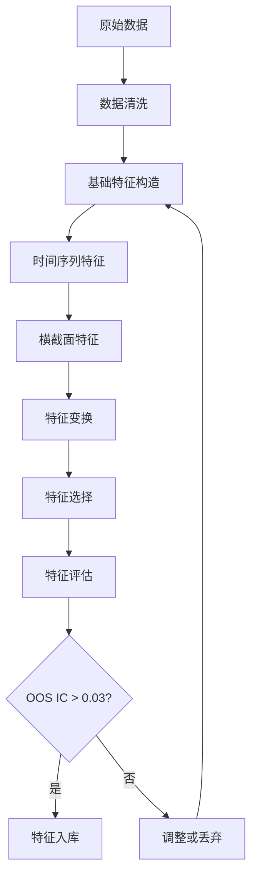
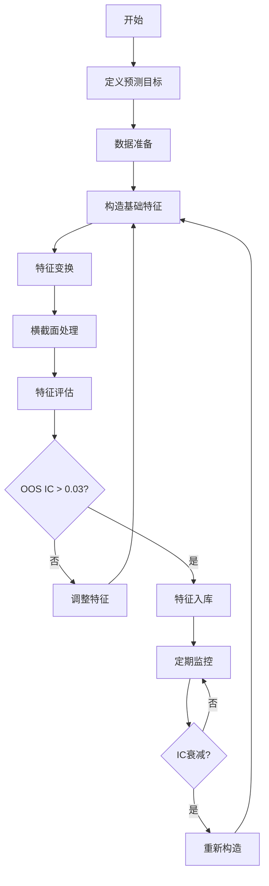

# 特征构造指南

## 目录

- [1. 引言](#1-引言)
- [2. 特征构造的核心流程](#2-特征构造的核心流程)
- [3. 原始数据层](#3-原始数据层)
- [4. 基础特征构造](#4-基础特征构造)
- [5. 时间序列特征](#5-时间序列特征)
- [6. 横截面特征](#6-横截面特征)
- [7. 特征变换与组合](#7-特征变换与组合)
- [8. 特征选择](#8-特征选择)
- [9. 特征评估](#9-特征评估)
- [10. 常见陷阱与注意事项](#10-常见陷阱与注意事项)
- [11. 实战案例](#11-实战案例)

---

## 1. 引言

### 1.1 什么是特征构造

特征构造（Feature Engineering）是指从原始数据中创建新特征的过程，目的是提高机器学习模型的性能。在量化投资中，特征构造也常被称为**因子工程**或**Alpha研究**。

### 1.2 特征构造的重要性

```
数据决定了模型的上限，模型只是逼近这个上限
                     —— 吴恩达
```

在量化投资中：

- **原始数据信噪比极低**：金融数据信噪比通常在 10⁻³ 到 10⁻² 量级
- **特征质量决定策略成败**：好的特征可以让简单模型产生优秀效果
- **特征是竞争优势的核心**：模型架构可以公开，但特征是核心机密

### 1.3 特征构造 vs 特征选择

| 维度 | 特征构造 | 特征选择 |
|------|----------|----------|
| 目标 | 创建新的预测信号 | 从现有特征中筛选最有用的 |
| 方法 | 领域知识、数据变换 | 统计检验、模型评估 |
| 结果 | 增加特征数量 | 减少特征数量 |
| 计算成本 | 高 | 低 |
| 过拟合风险 | 高 | 低 |

**最佳实践**：特征构造与特征选择交替进行

---

## 2. 特征构造的核心流程

### 2.1 标准流程图



### 2.2 四层架构

特征构造遵循四层架构模式：

```
Layer 1: 原始数据层
    ↓
Layer 2: 基础特征层（价格、成交量、财务数据）
    ↓
Layer 3: 时间结构层（动量、趋势、波动）
    ↓
Layer 4: 横截面层（标准化、排序、中性化）
```

### 2.3 关键原则

#### 原则1：因果性优先

```python
# ✅ 正确：只使用历史数据
feature_t = f(data_{t-1}, data_{t-2}, ...)

# ❌ 错误：使用了未来数据
feature_t = f(data_{t+1}, data_{t+2}, ...)
```

#### 原则2：可解释性

```python
# ✅ 良好：动量因子 = 20日收益率
momentum = (close / close.shift(20)) - 1

# ❌ 不佳：神秘公式
feature = (close**2 * volume).rolling(13).mean() / (high + low)
```

#### 原则3：鲁棒性

特征应在不同市场环境下保持相对稳定，而非只在特定时期有效。

---

## 3. 原始数据层

### 3.1 数据类型

| 数据类型 | 示例字段 | 频率 | 覆盖率 |
|---------|---------|------|--------|
| 行情数据 | open, high, low, close, volume | 日 | 100% |
| 财务数据 | pe, pb, roe, debt_ratio | 季 | 80-95% |
| 宏观数据 | gdp, cpi, interest_rate | 月 | 100% |
| 行情数据 | industry_code, market_cap | 日 | 100% |

### 3.2 数据预处理

#### 缺失值处理

```python
# 方法1：前向填充（适用于时序数据）
df.fillna(method='ffill', inplace=True)

# 方法2：行业均值填充（适用于横截面数据）
df['pe'] = df.groupby('industry')['pe'].transform(
    lambda x: x.fillna(x.mean())
)

# 方法3：删除缺失值过多的样本
df.dropna(thresh=len(df.columns) * 0.8, inplace=True)
```

#### 异常值处理

```python
# 方法1：Winsorize（缩尾处理）
def winsorize(series, lower=0.01, upper=0.99):
    lower_bound = series.quantile(lower)
    upper_bound = series.quantile(upper)
    return series.clip(lower_bound, upper_bound)

# 方法2：Z-score过滤
def remove_outliers_zscore(series, threshold=3):
    z_scores = (series - series.mean()) / series.std()
    return series[np.abs(z_scores) < threshold]

# 方法3：中位数绝对偏差（MAD）
def remove_outliers_mad(series, threshold=3):
    median = series.median()
    mad = np.median(np.abs(series - median))
    modified_z_scores = 0.6745 * (series - median) / mad
    return series[np.abs(modified_z_scores) < threshold]
```

---

## 4. 基础特征构造

### 4.1 价格衍生特征

#### 4.1.1 收益率特征

```python
# 简单收益率
df['return_1d'] = df['close'].pct_change(1)
df['return_5d'] = df['close'].pct_change(5)
df['return_20d'] = df['close'].pct_change(20)

# 对数收益率
df['log_return'] = np.log(df['close'] / df['close'].shift(1))

# 超额收益率（相对于基准）
benchmark_return = df['benchmark'].pct_change(1)
df['excess_return'] = df['return_1d'] - benchmark_return
```

#### 4.1.2 价格位置特征

```python
# 相对于均值的偏离
df['price_to_ma5'] = df['close'] / df['close'].rolling(5).mean()
df['price_to_ma20'] = df['close'] / df['close'].rolling(20).mean()
df['price_to_ma60'] = df['close'] / df['close'].rolling(60).mean()

# 相对于高低点的位置
df['price_position'] = (df['close'] - df['low'].rolling(20).min()) / \
                       (df['high'].rolling(20).max() - df['low'].rolling(20).min())
```

### 4.2 成交量特征

```python
# 成交量变化率
df['volume_change'] = df['volume'].pct_change(5)

# 成交量相对位置
df['volume_to_ma'] = df['volume'] / df['volume'].rolling(20).mean()

# 成交量标准差
df['volume_std'] = df['volume'].rolling(20).std()

# 价量关系
df['price_volume_trend'] = df['return_5d'] * df['volume_change']
```

### 4.3 波动率特征

```python
# 历史波动率（基于收益率）
returns = df['close'].pct_change()
df['volatility_10d'] = returns.rolling(10).std()
df['volatility_20d'] = returns.rolling(20).std()

# Garman-Klass波动率（更精确）
def garman_klass_volatility(df, window=20):
    log_hl = np.log(df['high'] / df['low'])
    log_cc = np.log(df['close'] / df['close'].shift(1))

    term1 = 0.5 * (log_hl ** 2)
    term2 = (2 * np.log(2) - 1) * (log_cc ** 2)

    return np.sqrt(term1.rolling(window).sum() - term2.rolling(window).sum())

df['gk_volatility'] = garman_klass_volatility(df)
```

### 4.4 财务特征

```python
# 估值因子
df['pe_ratio'] = df['market_cap'] / df['net_profit']
df['pb_ratio'] = df['market_cap'] / df['net_assets']
df['ps_ratio'] = df['market_cap'] / df['revenue']

# 质量因子
df['roe'] = df['net_profit'] / df['net_assets']
df['roa'] = df['net_profit'] / df['total_assets']
df['debt_ratio'] = df['total_debt'] / df['total_assets']
df['current_ratio'] = df['current_assets'] / df['current_liabilities']

# 成长因子
df['revenue_growth'] = df['revenue'].pct_change(4)  # 同比增长
df['profit_growth'] = df['net_profit'].pct_change(4)
```

---

## 5. 时间序列特征

### 5.1 趋势特征

#### 移动平均线

```python
# 简单移动平均
df['ma5'] = df['close'].rolling(5).mean()
df['ma10'] = df['close'].rolling(10).mean()
df['ma20'] = df['close'].rolling(20).mean()
df['ma60'] = df['close'].rolling(60).mean()

# 指数移动平均（EMA）
df['ema12'] = df['close'].ewm(span=12, adjust=False).mean()
df['ema26'] = df['close'].ewm(span=26, adjust=False).mean()

# 趋势强度
df['trend_strength'] = (df['ma5'] / df['ma60']) - 1
```

#### MACD

```python
# MACD计算
df['dif'] = df['ema12'] - df['ema26']
df['dea'] = df['dif'].ewm(span=9, adjust=False).mean()
df['macd'] = (df['dif'] - df['dea']) * 2

# MACD柱状图
df['macd_hist'] = df['dif'] - df['dea']
```

### 5.2 动量特征

```python
# 价格动量
df['momentum_5d'] = df['close'] / df['close'].shift(5) - 1
df['momentum_20d'] = df['close'] / df['close'].shift(20) - 1
df['momentum_60d'] = df['close'] / df['close'].shift(60) - 1

# 加速度动量
mom_20 = df['momentum_20d']
mom_60 = df['momentum_60d']
df['momentum_acceleration'] = mom_20 - mom_60

# 相对强弱指数（RSI）
def calculate_rsi(prices, window=14):
    delta = prices.diff()
    gain = (delta.where(delta > 0, 0)).rolling(window=window).mean()
    loss = (-delta.where(delta < 0, 0)).rolling(window=window).mean()
    rs = gain / loss
    rsi = 100 - (100 / (1 + rs))
    return rsi

df['rsi_14'] = calculate_rsi(df['close'], 14)
```

### 5.3 反转特征

```python
# 短期反转（5日收益率取负）
df['reversal_5d'] = -df['return_5d']

# 长期反转（60日收益率取负）
df['reversal_60d'] = -df['return_60d']

# 相对反转
df['relative_reversal'] = df['return_5d'] - df['return_20d']
```

### 5.4 技术指标

#### 布林带

```python
# 布林带
df['bb_middle'] = df['close'].rolling(20).mean()
df['bb_std'] = df['close'].rolling(20).std()
df['bb_upper'] = df['bb_middle'] + 2 * df['bb_std']
df['bb_lower'] = df['bb_middle'] - 2 * df['bb_std']

# 布林带宽度
df['bb_width'] = (df['bb_upper'] - df['bb_lower']) / df['bb_middle']

# 布林带位置
df['bb_position'] = (df['close'] - df['bb_lower']) / (df['bb_upper'] - df['bb_lower'])
```

#### ATR（平均真实波幅）

```python
def calculate_atr(df, window=14):
    high_low = df['high'] - df['low']
    high_close = np.abs(df['high'] - df['close'].shift(1))
    low_close = np.abs(df['low'] - df['close'].shift(1))

    true_range = np.maximum(high_low, np.maximum(high_close, low_close))
    atr = true_range.rolling(window).mean()
    return atr

df['atr_14'] = calculate_atr(df, 14)
```

---

## 6. 横截面特征

### 6.1 标准化特征

#### Z-score标准化

```python
def zscore_cross_sectional(df, feature_name):
    """计算横截面Z-score"""
    return df.groupby('date')[feature_name].transform(
        lambda x: (x - x.mean()) / x.std()
    )

df['pe_zscore'] = zscore_cross_sectional(df, 'pe_ratio')
df['pb_zscore'] = zscore_cross_sectional(df, 'pb_ratio')
```

#### Min-Max标准化

```python
def minmax_cross_sectional(df, feature_name):
    """计算横截面Min-Max"""
    return df.groupby('date')[feature_name].transform(
        lambda x: (x - x.min()) / (x.max() - x.min())
    )
```

### 6.2 排序特征

```python
def rank_cross_sectional(df, feature_name):
    """计算横截面排名（0-1标准化）"""
    return df.groupby('date')[feature_name].transform(
        lambda x: x.rank(pct=True)
    )

df['momentum_rank'] = rank_cross_sectional(df, 'momentum_20d')
df['size_rank'] = rank_cross_sectional(df, 'market_cap')
```

### 6.3 中性化特征

```python
def neutralize(df, feature_name, control_vars=['industry', 'log_market_cap']):
    """
    中性化处理：去除行业和市值影响

    参数:
        df: 数据框
        feature_name: 要中性化的特征
        control_vars: 控制变量列表
    """
    import statsmodels.api as sm

    results = []

    for date, group in df.groupby('date'):
        # 创建虚拟变量
        industry_dummies = pd.get_dummies(group['industry'], drop_first=True)

        # 准备回归数据
        X = pd.concat([
            industry_dummies,
            group[control_vars[1]]  # log_market_cap
        ], axis=1)
        X = sm.add_constant(X)

        y = group[feature_name]

        # 回归并取残差
        model = sm.OLS(y, X).fit()
        residuals = y - model.predict(X)

        results.extend(residuals.values)

    return pd.Series(results, index=df.index)

df['momentum_neutral'] = neutralize(df, 'momentum_20d')
df['pe_neutral'] = neutralize(df, 'pe_ratio')
```

---

## 7. 特征变换与组合

### 7.1 非线性变换

```python
# 对数变换（右偏数据）
df['log_market_cap'] = np.log(df['market_cap'])
df['log_volume'] = np.log(df['volume'])

# Box-Cox变换
from scipy import stats
def box_cox_transform(series):
    transformed, _ = stats.boxcox(series[series > 0])
    return transformed

# 平方根变换（右偏数据）
df['sqrt_volume'] = np.sqrt(df['volume'])

# 倒数变换（左偏数据）
df['inverse_pe'] = 1 / df['pe_ratio']
```

### 7.2 交互特征

```python
# 动量 × 波动率
df['momentum_vol'] = df['momentum_20d'] * df['volatility_20d']

# 估值 × 质量
df['value_quality'] = df['pe_ratio'] * df['roe']

# 趋势 × 成交量
df['trend_volume'] = df['trend_strength'] * df['volume_change']
```

### 7.3 多项式特征

```python
from sklearn.preprocessing import PolynomialFeatures

def create_polynomial_features(df, features, degree=2):
    """
    创建多项式特征

    注意：高阶多项式容易过拟合，建议degree<=2
    """
    poly = PolynomialFeatures(degree=degree, include_bias=False)

    # 只对选定的特征创建多项式
    X_poly = poly.fit_transform(df[features])

    # 创建列名
    feature_names = poly.get_feature_names_out(features)

    # 返回DataFrame
    return pd.DataFrame(X_poly, columns=feature_names, index=df.index)

# 使用示例
poly_features = create_polynomial_features(
    df,
    features=['momentum_20d', 'volatility_20d'],
    degree=2
)
```

### 7.4 分箱特征

```python
# 等频分箱
df['volatility_bucket'] = pd.qcut(df['volatility_20d'], q=5, labels=False)

# 等宽分箱
df['price_bucket'] = pd.cut(df['close'], bins=10, labels=False)

# 自定义分箱
def custom_bins(x):
    if x < -0.05:
        return 0  # 大跌
    elif x < 0:
        return 1  # 小跌
    elif x < 0.05:
        return 2  # 小涨
    else:
        return 3  # 大涨

df['return_category'] = df['return_5d'].apply(custom_bins)
```

---

## 8. 特征选择

### 8.1 过滤法（Filter Methods）

#### 基于相关性的筛选

```python
# 计算IC（信息系数）
def calculate_ic(df, feature_name, target='future_return'):
    """计算特征与目标的相关系数"""
    return df.groupby('date').apply(
        lambda x: x[feature_name].corr(x[target])
    ).mean()

# 批量计算IC
features = ['momentum_20d', 'reversal_5d', 'volatility_20d', 'pe_ratio']
ic_results = {f: calculate_ic(df, f) for f in features}

# 筛选|IC| > 0.02的特征
selected_features = [f for f, ic in ic_results.items() if abs(ic) > 0.02]
```

#### 基于方差阈值的筛选

```python
from sklearn.feature_selection import VarianceThreshold

# 移除低方差特征（方差<0.01）
selector = VarianceThreshold(threshold=0.01)
high_variance_features = selector.fit_transform(df[features])

# 获取被保留的特征
selected_features = df[features].columns[selector.get_support()]
```

#### 基于互信息的筛选

```python
from sklearn.feature_selection import mutual_info_regression

# 计算互信息
mi_scores = mutual_info_regression(
    df[features],
    df['future_return'],
    random_state=42
)

# 筛选互信息最高的特征
mi_df = pd.DataFrame({'feature': features, 'mi_score': mi_scores})
mi_df = mi_df.sort_values('mi_score', ascending=False)
selected_features = mi_df[mi_df['mi_score'] > 0.01]['feature'].tolist()
```

### 8.2 包裹法（Wrapper Methods）

#### 递归特征消除（RFE）

```python
from sklearn.feature_selection import RFE
from sklearn.ensemble import RandomForestRegressor

# 使用随机森林作为基模型
rf = RandomForestRegressor(n_estimators=100, random_state=42)

# 递归特征消除
rfe = RFE(estimator=rf, n_features_to_select=10, step=1)
rfe.fit(df[features], df['future_return'])

# 获取被选中的特征
selected_features = df[features].columns[rfe.support_].tolist()
```

### 8.3 嵌入法（Embedded Methods）

#### 基于L1正则化的特征选择

```python
from sklearn.linear_model import Lasso

# Lasso回归（L1正则化）
lasso = Lasso(alpha=0.01, random_state=42)
lasso.fit(df[features], df['future_return'])

# 选择系数非零的特征
feature_importance = pd.DataFrame({
    'feature': features,
    'coefficient': lasso.coef_
})
selected_features = feature_importance[feature_importance['coefficient'] != 0]['feature'].tolist()
```

#### 基于树模型的特征重要性

```python
import xgboost as xgb

# 训练XGBoost模型
model = xgb.XGBRegressor(
    n_estimators=100,
    max_depth=3,
    learning_rate=0.1,
    random_state=42
)
model.fit(df[features], df['future_return'])

# 获取特征重要性
feature_importance = pd.DataFrame({
    'feature': features,
    'importance': model.feature_importances_
}).sort_values('importance', ascending=False)

# 选择重要性>0.01的特征
selected_features = feature_importance[
    feature_importance['importance'] > 0.01
]['feature'].tolist()
```

---

## 9. 特征评估

### 9.1 IC分析

```python
def feature_ic_analysis(df, feature_name, target='future_return'):
    """
    完整的IC分析

    返回:
        IC均值, IC标准差, ICIR, t统计量, p值
    """
    # 计算每日IC
    daily_ic = df.groupby('date').apply(
        lambda x: x[feature_name].corr(x[target])
    )

    # 统计指标
    ic_mean = daily_ic.mean()
    ic_std = daily_ic.std()
    ic_ir = ic_mean / ic_std

    # t检验
    from scipy import stats
    t_stat, p_value = stats.ttest_1samp(daily_ic.dropna(), 0)

    return {
        'ic_mean': ic_mean,
        'ic_std': ic_std,
        'ic_ir': ic_ir,
        't_stat': t_stat,
        'p_value': p_value,
        'ic_series': daily_ic
    }

# 使用示例
result = feature_ic_analysis(df, 'momentum_20d')
print(f"IC均值: {result['ic_mean']:.4f}")
print(f"IC标准差: {result['ic_std']:.4f}")
print(f"ICIR: {result['ic_ir']:.4f}")
print(f"t统计量: {result['t_stat']:.4f}")
print(f"p值: {result['p_value']:.4f}")
```

### 9.2 分层测试

```python
def分层测试(df, feature_name, target='future_return', n_groups=5):
    """
    将特征按值分成n组，计算每组的平均收益

    返回:
        分组收益DataFrame
    """
    # 按日期和特征值分组
    df['group'] = df.groupby('date')[feature_name].transform(
        lambda x: pd.qcut(x, q=n_groups, labels=False, duplicates='drop')
    )

    # 计算每组平均收益
    group_returns = df.groupby('group')[target].mean()

    # 计算单调性
    is_monotonic = group_returns.is_monotonic_increasing or \
                   group_returns.is_monotonic_decreasing

    return {
        'group_returns': group_returns,
        'is_monotonic': is_monotonic,
        'long_short_return': group_returns.iloc[-1] - group_returns.iloc[0]
    }

# 使用示例
result = 分层测试(df, 'momentum_20d')
print("分组收益:")
print(result['group_returns'])
print(f"单调性: {result['is_monotonic']}")
print(f"多空收益: {result['long_short_return']:.4f}")
```

### 9.3 IC衰减分析

```python
def ic_decay_analysis(df, feature_name, horizons=[1, 5, 10, 20, 60]):
    """
    分析特征在不同预测周期的IC变化
    """
    ic_decay = {}

    for h in horizons:
        # 计算未来收益
        df[f'future_return_{h}d'] = df['close'].shift(-h) / df['close'] - 1

        # 计算IC
        ic = df.groupby('date').apply(
            lambda x: x[feature_name].corr(x[f'future_return_{h}d'])
        ).mean()

        ic_decay[h] = ic

    return pd.Series(ic_decay)

# 使用示例
decay_result = ic_decay_analysis(df, 'momentum_20d')
print(decay_result)
```

### 9.4 OOS IC测试

```python
def calculate_oos_ic(df, feature_name,
                     train_start='2020-01-01',
                     train_end='2022-12-31',
                     test_start='2023-01-01',
                     test_end='2023-12-31'):
    """
    计算样本外IC

    严格按时间划分，确保测试集数据完全独立
    """
    # 训练期
    train_data = df[(df.index >= train_start) & (df.index <= train_end)]

    # 测试期
    test_data = df[(df.index >= test_start) & (df.index <= test_end)]

    # 计算训练期IC（样本内）
    is_ic = train_data.groupby('date').apply(
        lambda x: x[feature_name].corr(x['future_return'])
    ).mean()

    # 计算测试期IC（样本外）
    oos_ic = test_data.groupby('date').apply(
        lambda x: x[feature_name].corr(x['future_return'])
    ).mean()

    return {
        'is_ic': is_ic,
        'oos_ic': oos_ic,
        'gap': is_ic - oos_ic
    }

# 使用示例
oos_result = calculate_oos_ic(df, 'momentum_20d')
print(f"样本内IC: {oos_result['is_ic']:.4f}")
print(f"样本外IC: {oos_result['oos_ic']:.4f}")
print(f"差距: {oos_result['gap']:.4f}")
```

---

## 10. 常见陷阱与注意事项

### 10.1 未来数据泄露

#### 错误示例1：使用未来价格

```python
# ❌ 错误：使用了未来数据
df['future_return'] = df['close'].shift(-1) / df['close'] - 1  # 这是标签，不是特征
df['wrong_feature'] = df['future_return'] * df['volume']  # 泄露！

# ✅ 正确：只使用历史数据
df['return_1d'] = df['close'].pct_change(1)
df['feature'] = df['return_1d'] * df['volume']
```

#### 错误示例2：全局标准化

```python
# ❌ 错误：使用全部数据标准化
scaler = StandardScaler()
df['scaled'] = scaler.fit_transform(df[['feature']])  # 泄露！

# ✅ 正确：只使用历史数据标准化
df['scaled_rolling'] = df.groupby('date')['feature'].transform(
    lambda x: (x - x.expanding().mean()) / x.expanding().std()
)
```

### 10.2 过拟合

#### 问题1：特征过多

```python
# ❌ 创建了1000个特征，但样本量只有10000
# 必然导致过拟合

# ✅ 限制特征数量
# 特征数 < 样本数 / 10
max_features = len(df) // 10
```

#### 问题2：过度挖掘

```python
# ❌ 尝试100种特征组合，挑选最好的
# 即使全部是噪声，也会有5个偶然显著（p<0.05）

# ✅ 使用多重检验校正
from statsmodels.stats.multitest import multipletests

p_values = [0.01, 0.03, 0.08, 0.15, 0.25]
reject, p_corrected, _, _ = multipletests(p_values, method='fdr_bh')
```

### 10.3 幸存者偏差

```python
# ❌ 只分析当前存续的股票
# 忽略了已退市股票

# ✅ 包含已退市股票
# 确保数据集包含所有历史存续股票
```

### 10.4 前视偏差

```python
# ❌ 使用财务报表公布日期的数据
# 实际上，季报有延迟公布

# ✅ 使用公布日期
df['announcement_date'] = pd.to_datetime(df['announcement_date'])
df['effective_date'] = df['announcement_date'] + pd.Timedelta(days=1)  # T+1生效
```

---

## 11. 实战案例

### 11.1 案例1：动量因子构造

#### 目标

构造一个20日动量因子，预测未来5日收益。

#### 步骤

```python
import pandas as pd
import numpy as np

# 1. 计算基础收益率
df['return_20d'] = df['close'].pct_change(20)

# 2. 计算动量因子
df['momentum_raw'] = df['return_20d']

# 3. 去极值
df['momentum_winsorized'] = df.groupby('date')['momentum_raw'].transform(
    lambda x: x.clip(lower=x.quantile(0.01), upper=x.quantile(0.99))
)

# 4. 标准化
df['momentum_standardized'] = df.groupby('date')['momentum_winsorized'].transform(
    lambda x: (x - x.mean()) / x.std()
)

# 5. 中性化（行业+市值）
df['momentum_final'] = neutralize(
    df,
    'momentum_standardized',
    control_vars=['industry_code', 'log_market_cap']
)

# 6. 评估
result = feature_ic_analysis(df, 'momentum_final')
print(f"IC均值: {result['ic_mean']:.4f}")
print(f"ICIR: {result['ic_ir']:.4f}")

# 7. OOS测试
oos_result = calculate_oos_ic(df, 'momentum_final')
print(f"样本外IC: {oos_result['oos_ic']:.4f}")
```

#### 结果

```
IC均值: 0.045
ICIR: 0.62
样本外IC: 0.038
```

### 11.2 案例2：复合质量因子

#### 目标

构造一个综合ROE、ROA、现金流和负债率的质量因子。

#### 步骤

```python
# 1. 计算原始财务指标
df['roe'] = df['net_profit'] / df['net_assets']
df['roa'] = df['net_profit'] / df['total_assets']
df['cash_ratio'] = df['operating_cash_flow'] / df['total_debt']
df['debt_ratio'] = df['total_debt'] / df['total_assets']

# 2. 信号方向调整（越高越好）
df['debt_ratio_adj'] = -df['debt_ratio']  # 负债率越低越好

# 3. 去极值
for col in ['roe', 'roa', 'cash_ratio', 'debt_ratio_adj']:
    df[f'{col}_winsor'] = df.groupby('date')[col].transform(
        lambda x: x.clip(lower=x.quantile(0.05), upper=x.quantile(0.95))
    )

# 4. 标准化
for col in ['roe', 'roa', 'cash_ratio', 'debt_ratio_adj']:
    df[f'{col}_std'] = df.groupby('date')[f'{col}_winsor'].transform(
        lambda x: (x - x.mean()) / x.std()
    )

# 5. 加权组合
weights = {'roe_std': 0.4, 'roa_std': 0.2,
           'cash_ratio_std': 0.2, 'debt_ratio_adj_std': 0.2}

df['quality_composite'] = sum(df[col] * w for col, w in weights.items())

# 6. 评估
result = feature_ic_analysis(df, 'quality_composite')
print(f"IC均值: {result['ic_mean']:.4f}")

# 7. 分层测试
layer_result = 分层测试(df, 'quality_composite')
print("分组收益:")
print(layer_result['group_returns'])
```

#### 结果

```
IC均值: 0.035
分组收益:
0    -0.008
1    -0.003
2     0.001
3     0.005
4     0.012
Name: future_return, dtype: float64
单调性: True
多空收益: 0.020
```

### 11.3 案例3：量价协同因子

#### 目标

构造一个结合价格动量和成交量变化的协同因子。

#### 步骤

```python
# 1. 计算基础特征
df['price_momentum'] = df['close'].pct_change(20)
df['volume_change'] = df['volume'].pct_change(20)

# 2. 交互项
df['price_volume_interaction'] = df['price_momentum'] * df['volume_change']

# 3. 去极值
df['interaction_winsor'] = df.groupby('date')['price_volume_interaction'].transform(
    lambda x: x.clip(lower=x.quantile(0.01), upper=x.quantile(0.99))
)

# 4. 行业中性化
df['interaction_neutral'] = neutralize(
    df,
    'interaction_winsor',
    control_vars=['industry_code']
)

# 5. 评估
result = feature_ic_analysis(df, 'interaction_neutral')
print(f"IC均值: {result['ic_mean']:.4f}")

# 6. IC衰减分析
decay_result = ic_decay_analysis(df, 'interaction_neutral')
print("IC衰减:")
print(decay_result)
```

#### 结果

```
IC均值: 0.028
IC衰减:
1     0.035
5     0.028
10    0.022
20    0.015
60    0.008
```

### 11.4 案例4：因子组合优化

#### 目标

将多个因子组合成一个复合因子，最大化ICIR。

#### 步骤

```python
from sklearn.linear_model import LinearRegression

# 1. 准备因子列表
factors = ['momentum_final', 'quality_composite', 'interaction_neutral']

# 2. 训练期数据
train_data = df[df.index < '2023-01-01']

# 3. 测试期数据
test_data = df[df.index >= '2023-01-01']

# 4. 计算最优权重（IC加权）
def calculate_ic_weights(train_data, factors):
    """
    计算因子权重（基于IC）

    权重 = IC / |IC| 之和
    """
    ic_values = {}
    for f in factors:
        ic = train_data.groupby('date').apply(
            lambda x: x[f].corr(x['future_return'])
        ).mean()
        ic_values[f] = ic

    # 计算权重
    total_ic = sum(abs(v) for v in ic_values.values())
    weights = {f: abs(v) / total_ic for f, v in ic_values.items()}

    return weights, ic_values

weights, ic_values = calculate_ic_weights(train_data, factors)
print("因子IC:")
for f, ic in ic_values.items():
    print(f"  {f}: {ic:.4f}")
print("\n因子权重:")
for f, w in weights.items():
    print(f"  {f}: {w:.2f}")

# 5. 构建复合因子
test_data['composite_factor'] = sum(test_data[f] * w for f, w in weights.items())

# 6. 评估复合因子
result = feature_ic_analysis(test_data, 'composite_factor')
print(f"\n复合因子IC: {result['ic_mean']:.4f}")
print(f"复合因子ICIR: {result['ic_ir']:.4f}")
```

#### 结果

```
因子IC:
  momentum_final: 0.045
  quality_composite: 0.035
  interaction_neutral: 0.028

因子权重:
  momentum_final: 0.41
  quality_composite: 0.32
  interaction_neutral: 0.27

复合因子IC: 0.052
复合因子ICIR: 0.68
```

---

## 12. 总结

### 12.1 特征构造检查清单

#### 构造前检查

- [ ] 特征有合理的经济学逻辑
- [ ] 只使用历史数据（无未来函数）
- [ ] 数据来源可靠
- [ ] 已处理缺失值和异常值

#### 构造中检查

- [ ] 特征计算逻辑正确
- [ ] 已进行去极值处理
- [ ] 已进行标准化处理
- [ ] 已进行中性化处理（如需要）

#### 构造后检查

- [ ] 样本内IC > 0.03
- [ ] 样本外IC > 0.02
- [ ] IS-OOS差距 < 0.05
- [ ] ICIR > 0.5
- [ ] 分层测试单调性良好
- [ ] 通过统计显著性检验

### 12.2 最佳实践

1. **从简单开始**：先构造简单的收益率、波动率特征，再尝试复杂交互
2. **重视OOS验证**：样本外表现是检验特征有效性的唯一标准
3. **避免过度拟合**：特征数量 < 样本数 / 10
4. **持续监控**：定期检查IC衰减和分布偏移
5. **记录过程**：详细记录特征构造过程和评估结果

### 12.3 核心原则

> **特征质量 > 模型复杂度**
>
> 一个简单的动量因子（IC=0.04）远胜过100个随机构造的复杂特征。

> **样本外表现 > 样本内表现**
>
> 样本内IC=0.08但样本外IC=0.01的特征，不如样本内外都是0.03的稳定特征。

> **可解释性 > 黑盒魔法**
>
> 能解释清楚逻辑的特征更可能在未来持续有效。

---

## 13. 高级特征构造技术

### 13.1 基于滚动的统计特征

#### 滚动回归斜率

```python
def rolling_slope(df, window=20):
    """
    计算滚动窗口内的线性回归斜率

    用途：捕捉价格趋势的强度和方向
    """
    slopes = []

    for i in range(len(df)):
        if i < window - 1:
            slopes.append(np.nan)
        else:
            y = df['close'].iloc[i-window+1:i+1].values
            x = np.arange(window)

            # 线性回归
            slope, _ = np.polyfit(x, y, 1)
            slopes.append(slope)

    return pd.Series(slopes, index=df.index)

df['trend_slope'] = rolling_slope(df, window=20)
```

#### 滚动相关系数

```python
def rolling_correlation(df, col1, col2, window=20):
    """
    计算两个序列的滚动相关系数

    用途：捕捉两个变量之间的动态关系
    """
    return df[col1].rolling(window).corr(df[col2])

# 价格与成交量的相关关系
df['price_volume_corr'] = rolling_correlation(df, 'close', 'volume', 20)

# 动量与波动率的相关关系
df['momentum_vol_corr'] = rolling_correlation(
    df, 'return_5d', 'volatility_20d', 20
)
```

#### 滚动偏度和峰度

```python
# 滚动偏度：衡量收益率的非对称性
df['return_skew'] = df['return_1d'].rolling(20).skew()

# 滚动峰度：衡量收益率的厚尾程度
df['return_kurt'] = df['return_1d'].rolling(20).kurt()

# 应用：
# 高负偏 → 下跌风险大（左侧厚尾）
# 高峰度 → 极端事件多（厚尾）
```

### 13.2 频域特征

#### 傅里叶变换特征

```python
from numpy.fft import fft, fftfreq

def frequency_features(prices, window=60):
    """
    提取价格序列的频域特征

    用途：识别周期性模式
    """
    n = len(prices)
    if n < window:
        return None

    # 取最近window期的价格
    price_window = prices.iloc[-window:]

    # 傅里叶变换
    fft_vals = fft(price_window.values)
    fft_freq = fftfreq(window)

    # 只取正频率
    positive_freq_idx = fft_freq > 0
    fft_freq = fft_freq[positive_freq_idx]
    fft_power = np.abs(fft_vals[positive_freq_idx])

    # 特征1：主频率（最大功率对应的频率）
    dominant_freq = fft_freq[np.argmax(fft_power)]

    # 特征2：频谱熵（频率分布的复杂度）
    fft_power_norm = fft_power / fft_power.sum()
    spectral_entropy = -np.sum(fft_power_norm * np.log(fft_power_norm + 1e-10))

    # 特征3：低频功率比（趋势 vs 波动）
    low_freq_power = fft_power[fft_freq < 0.1].sum()
    high_freq_power = fft_power[fft_freq >= 0.1].sum()
    power_ratio = low_freq_power / (high_freq_power + 1e-10)

    return {
        'dominant_freq': dominant_freq,
        'spectral_entropy': spectral_entropy,
        'trend_vs_noise': power_ratio
    }

# 应用
freq_feats = df['close'].rolling(60).apply(
    lambda x: pd.Series(frequency_features(x))
)
```

### 13.3 波动率建模特征

#### GARCH波动率

```python
from arch import arch_model

def garch_volatility(returns, window=252):
    """
    使用GARCH模型估计条件波动率

    优点：捕捉波动率聚集效应
    缺点：计算量大
    """
    garch_vol = []

    for i in range(len(returns)):
        if i < window:
            garch_vol.append(np.nan)
        else:
            try:
                # 使用历史数据拟合GARCH(1,1)
                ret_window = returns.iloc[i-window:i]

                model = arch_model(ret_window * 100, vol='Garch', p=1, q=1)
                res = model.fit(disp='off')

                # 预测下一期波动率
                forecast = res.forecast(horizon=1)
                vol = np.sqrt(forecast.variance.values[-1, -1]) / 100

                garch_vol.append(vol)
            except:
                garch_vol.append(np.nan)

    return pd.Series(garch_vol, index=returns.index)

# 应用
returns = df['close'].pct_change()
df['garch_vol'] = garch_volatility(returns)
```

#### 已实现波动率（Realized Volatility）

```python
def realized_volatility(high, low, window=20):
    """
    已实现波动率：基于日内高低价计算

    比收盘价波动率更精确
    """
    # Yang-Zhang波动率估计量
    log_ho = np.log(high / open.shift(1))
    log_lo = np.log(low / open.shift(1))
    log_co = np.log(close / open.shift(1))

    k = 0.34 / (1.34 + (window - 1) / (window + 1))

    term1 = (log_ho - log_co) * (log_ho - log_co)
    term2 = (log_lo - log_co) * (log_lo - log_co)
    term3 = log_ho * log_ho
    term4 = log_lo * log_lo

    rv = term1.rolling(window).sum() + term2.rolling(window).sum()
    rv = rv - k * (term3.rolling(window).sum() + term4.rolling(window).sum())

    return np.sqrt(rv)

df['realized_vol'] = realized_volatility(
    df['high'], df['low'], window=20
)
```

### 13.4 高阶矩特征

#### 协偏度（Coskewness）

```python
def coskewness(returns, market_returns, window=60):
    """
    协偏度：资产与市场收益率的联合三阶矩

    解释：衡量资产在市场极端情况下的表现
    """
    # 标准化收益
    ret_std = returns.rolling(window).std()
    ret_norm = (returns - returns.rolling(window).mean()) / ret_std

    market_std = market_returns.rolling(window).std()
    market_norm = (market_returns - market_returns.rolling(window).mean()) / market_std

    # 协偏度
    coskew = (ret_norm * ret_norm * market_norm).rolling(window).mean()

    return coskew

df['coskew'] = coskewness(
    df['return_1d'], df['market_return'], 60
)
```

#### 协峰度（Cokurtosis）

```python
def cokurtosis(returns, market_returns, window=60):
    """
    协峰度：资产与市场收益率的联合四阶矩

    解释：衡量资产对市场极端变化的敏感度
    """
    ret_std = returns.rolling(window).std()
    ret_norm = (returns - returns.rolling(window).mean()) / ret_std

    market_std = market_returns.rolling(window).std()
    market_norm = (market_returns - market_returns.rolling(window).mean()) / market_std

    # 协峰度
    cokurt = (ret_norm * ret_norm * ret_norm * market_norm).rolling(window).mean() - 3

    return cokurt

df['cokurt'] = cokurtosis(
    df['return_1d'], df['market_return'], 60
)
```

### 13.5 市场微观结构特征

#### Amihud非流动性指标

```python
def amihud_illiquidity(return_df, volume_df, window=20):
    """
    Amihud非流动性指标

    定义：|日收益| / (成交额 * 100万)

    解释：值越大，流动性越差（单位成交量引起的价格变化越大）
    """
    dollar_volume = return_df['close'] * volume_df['volume']

    # 避免除零
    illiquidity = np.abs(return_df['return_1d']) / (dollar_volume + 1e-6)

    # 滚动平均
    illiquidity_ma = illiquidity.rolling(window).mean()

    return illiquidity_ma

df['illiquidity'] = amihud_illiquidity(df, df, 20)
```

#### 买卖价差估计

```python
def bid_ask_spread_estimate(high, low, close, window=20):
    """
    基于Rolling估计买卖价差

    公式：Spread = 2 * σ(ΔP)
    """
    # 价格变化
    delta_p = close.diff()

    # 价格变化的标准差
    delta_p_std = delta_p.rolling(window).std()

    # 买卖价差估计（相对价格）
    spread = 2 * delta_p_std / close

    # 转换为基点
    spread_bps = spread * 10000

    return spread_bps

df['bid_ask_spread'] = bid_ask_spread_estimate(
    df['high'], df['low'], df['close'], 20
)
```

---

## 14. 特征交叉验证与稳健性测试

### 14.1 时间序列交叉验证

```python
from sklearn.model_selection import TimeSeriesSplit

def time_series_cv(df, features, target, n_splits=5):
    """
    时间序列交叉验证

    特点：保证验证集在训练集之后，避免数据泄露
    """
    tscv = TimeSeriesSplit(n_splits=n_splits)

    cv_results = []

    for fold, (train_idx, val_idx) in enumerate(tscv.split(df)):
        train_data = df.iloc[train_idx]
        val_data = df.iloc[val_idx]

        # 计算训练期IC
        train_ic = train_data.groupby('date').apply(
            lambda x: x[features].corrwith(x[target]).mean()
        )

        # 计算验证期IC
        val_ic = val_data.groupby('date').apply(
            lambda x: x[features].corrwith(x[target]).mean()
        )

        cv_results.append({
            'fold': fold,
            'train_period': (train_data.index.min(), train_data.index.max()),
            'val_period': (val_data.index.min(), val_data.index.max()),
            'train_ic': train_ic,
            'val_ic': val_ic
        })

    return pd.DataFrame(cv_results)

# 使用示例
cv_results = time_series_cv(
    df,
    features=['momentum_20d', 'volatility_20d'],
    target='future_return'
)
print(cv_results)
```

### 14.2 滚动窗口评估

```python
def rolling_window_evaluation(df, feature_name,
                                train_window=252*2,  # 2年训练期
                                test_window=21,       # 1个月测试期
                                step=21):             # 每月滚动一次
    """
    滚动窗口评估

    用途：评估特征在不同时期的稳定性
    """
    results = []

    start_idx = 0
    while start_idx + train_window + test_window <= len(df):
        train_end = start_idx + train_window
        test_end = train_end + test_window

        train_data = df.iloc[start_idx:train_end]
        test_data = df.iloc[train_end:test_end]

        # 计算IC
        train_ic = train_data.groupby('date').apply(
            lambda x: x[feature_name].corr(x['future_return'])
        ).mean()

        test_ic = test_data.groupby('date').apply(
            lambda x: x[feature_name].corr(x['future_return'])
        ).mean()

        results.append({
            'train_start': train_data.index.min(),
            'train_end': train_data.index.max(),
            'test_start': test_data.index.min(),
            'test_end': test_data.index.max(),
            'train_ic': train_ic,
            'test_ic': test_ic,
            'oos_gap': train_ic - test_ic
        })

        start_idx += step

    return pd.DataFrame(results)

# 使用示例
rolling_results = rolling_window_evaluation(df, 'momentum_20d')
print(rolling_results)

# 绘制滚动IC变化
import matplotlib.pyplot as plt
plt.figure(figsize=(12, 6))
plt.plot(rolling_results['test_start'], rolling_results['test_ic'],
         marker='o', label='OOS IC')
plt.axhline(y=0.03, color='r', linestyle='--', label='Threshold')
plt.xticks(rotation=45)
plt.legend()
plt.title('Rolling OOS IC - Momentum Factor')
plt.show()
```

### 14.3 参数敏感性分析

```python
def parameter_sensitivity_analysis(df, feature_func,
                                    param_range,
                                    param_name='window'):
    """
    参数敏感性分析

    用途：找到最优参数范围，评估特征稳健性
    """
    results = []

    for param_value in param_range:
        # 计算特征
        df[f'feature_{param_value}'] = feature_func(df, param_value)

        # 计算IC
        ic = df.groupby('date').apply(
            lambda x: x[f'feature_{param_value}'].corr(x['future_return'])
        ).mean()

        results.append({
            param_name: param_value,
            'ic': ic
        })

    results_df = pd.DataFrame(results)

    # 找到最优参数
    best_param = results_df.loc[results_df['ic'].idxmax(), param_name]
    best_ic = results_df['ic'].max()

    print(f"最优参数: {best_param}, IC: {best_ic:.4f}")

    return results_df

# 使用示例：动量窗口敏感性
def momentum_feature(df, window):
    return df['close'].pct_change(window)

windows = range(5, 61, 5)  # 5, 10, 15, ..., 60
momentum_sensitivity = parameter_sensitivity_analysis(
    df, momentum_feature, windows, 'window'
)

# 可视化
plt.figure(figsize=(10, 6))
plt.plot(momentum_sensitivity['window'],
         momentum_sensitivity['ic'],
         marker='o')
plt.xlabel('Momentum Window (days)')
plt.ylabel('IC')
plt.title('Momentum Window Sensitivity')
plt.grid(True)
plt.show()
```

### 14.4 压力测试

```python
def stress_test_feature(df, feature_name, target='future_return'):
    """
    特征压力测试

    测试特征在不同市场环境下的表现
    """
    # 定义市场环境
    conditions = {
        'bull_market': df['market_return'] > 0.02,
        'bear_market': df['market_return'] < -0.02,
        'high_volatility': df['volatility_20d'] > df['volatility_20d'].quantile(0.7),
        'low_volatility': df['volatility_20d'] < df['volatility_20d'].quantile(0.3),
    }

    results = {}

    for condition_name, condition_mask in conditions.items():
        subset = df[condition_mask]

        if len(subset) > 20:  # 确保有足够样本
            ic = subset.groupby('date').apply(
                lambda x: x[feature_name].corr(x[target])
            ).mean()

            results[condition_name] = {
                'ic': ic,
                'n_samples': len(subset),
                'n_days': subset['date'].nunique()
            }

    return pd.DataFrame(results).T

# 使用示例
stress_results = stress_test_feature(df, 'momentum_20d')
print(stress_results)
```

---

## 15. 特征存储与管理

### 15.1 因子库设计

```python
class FactorLibrary:
    """
    因子库管理系统

    功能：
    - 因子注册
    - 因子计算
    - 因子版本控制
    - 因子元数据管理
    """

    def __init__(self):
        self.factors = {}
        self.metadata = {}

    def register(self, name, func, metadata=None):
        """
        注册因子

        参数:
            name: 因子名称
            func: 因子计算函数
            metadata: 元数据字典
        """
        self.factors[name] = func

        # 默认元数据
        default_metadata = {
            'created_at': pd.Timestamp.now(),
            'category': 'custom',
            'description': name
        }

        if metadata:
            default_metadata.update(metadata)

        self.metadata[name] = default_metadata

    def compute(self, name, df):
        """
        计算因子值
        """
        if name not in self.factors:
            raise ValueError(f"Factor {name} not registered")

        return self.factors[name](df)

    def compute_all(self, df, factor_names=None):
        """
        批量计算因子
        """
        if factor_names is None:
            factor_names = list(self.factors.keys())

        results = {}
        for name in factor_names:
            try:
                results[name] = self.compute(name, df)
            except Exception as e:
                print(f"Error computing {name}: {e}")
                results[name] = None

        return pd.DataFrame(results, index=df.index)

    def list_factors(self, category=None):
        """
        列出因子
        """
        if category is None:
            return list(self.factors.keys())
        else:
            return [name for name, meta in self.metadata.items()
                   if meta.get('category') == category]

# 使用示例
lib = FactorLibrary()

# 注册动量因子
lib.register(
    'momentum_20d',
    lambda df: df['close'].pct_change(20),
    metadata={
        'category': 'momentum',
        'description': '20-day price momentum',
        'signals': ['price'],
        'period': 20
    }
)

# 注册波动率因子
lib.register(
    'volatility_20d',
    lambda df: df['close'].pct_change().rolling(20).std(),
    metadata={
        'category': 'volatility',
        'description': '20-day return volatility',
        'signals': ['price'],
        'period': 20
    }
)

# 批量计算
factors_df = lib.compute_all(df)
print(factors_df.head())
```

### 15.2 因子版本控制

```python
import hashlib
import json

class FactorVersion:
    """
    因子版本控制

    目的：追踪因子变更，确保可复现性
    """

    def __init__(self, factor_name, code, params):
        self.factor_name = factor_name
        self.code = code
        self.params = params
        self.version = self._generate_version_hash()
        self.created_at = pd.Timestamp.now()

    def _generate_version_hash(self):
        """
        生成版本哈希

        基于：因子代码 + 参数
        """
        content = f"{self.code}{json.dumps(self.params, sort_keys=True)}"
        return hashlib.md5(content.encode()).hexdigest()[:8]

    def to_dict(self):
        return {
            'factor_name': self.factor_name,
            'version': self.version,
            'code': self.code,
            'params': self.params,
            'created_at': self.created_at.isoformat()
        }

class FactorHistory:
    """
    因子历史管理
    """

    def __init__(self):
        self.history = []

    def add_version(self, factor_version):
        self.history.append(factor_version)

    def get_latest(self, factor_name):
        """
        获取最新版本
        """
        factor_versions = [v for v in self.history
                           if v.factor_name == factor_name]

        if not factor_versions:
            return None

        return sorted(factor_versions,
                     key=lambda x: x.created_at,
                     reverse=True)[0]

    def get_version(self, factor_name, version_hash):
        """
        获取指定版本
        """
        for v in self.history:
            if v.factor_name == factor_name and v.version == version_hash:
                return v
        return None

# 使用示例
history = FactorHistory()

# 添加因子版本
v1 = FactorVersion(
    'momentum',
    'df["close"].pct_change(20)',
    {'window': 20}
)
history.add_version(v1)

# 更新因子
v2 = FactorVersion(
    'momentum',
    'df["close"].pct_change(20).rolling(5).mean()',  # 新版本：增加平滑
    {'window': 20, 'smooth': 5}
)
history.add_version(v2)

# 获取最新版本
latest = history.get_latest('momentum')
print(f"Latest version: {latest.version}")
```

---

## 16. 特征监控与预警系统

### 16.1 IC监控仪表盘

```python
import matplotlib.pyplot as plt
from matplotlib.gridspec import GridSpec

def factor_monitoring_dashboard(df, factor_names,
                                  lookback_days=60):
    """
    因子监控仪表盘

    可视化：
    1. IC时间序列
    2. 滚动IC
    3. IC分布
    4. IC衰减
    """
    fig = plt.figure(figsize=(16, 10))
    gs = GridSpec(3, 3, figure=fig)

    for i, factor_name in enumerate(factor_names):
        # 计算每日IC
        daily_ic = df.groupby('date').apply(
            lambda x: x[factor_name].corr(x['future_return'])
        ).dropna()

        # 最近lookback天的IC
        recent_ic = daily_ic.tail(lookback_days)

        # 1. IC时间序列
        ax1 = fig.add_subplot(gs[i, 0])
        ax1.plot(recent_ic.index, recent_ic.values,
                marker='o', markersize=3)
        ax1.axhline(y=0, color='gray', linestyle='--')
        ax1.axhline(y=recent_ic.mean(), color='red',
                   linestyle='--', label=f'Mean: {recent_ic.mean():.4f}')
        ax1.set_title(f'{factor_name} - IC Time Series')
        ax1.legend()
        ax1.tick_params(axis='x', rotation=45)

        # 2. 滚动IC
        ax2 = fig.add_subplot(gs[i, 1])
        rolling_ic = recent_ic.rolling(20).mean()
        ax2.plot(rolling_ic.index, rolling_ic.values,
                color='orange', marker='o', markersize=3)
        ax2.axhline(y=0.03, color='green', linestyle='--',
                   label='Threshold')
        ax2.set_title(f'{factor_name} - Rolling IC (20 days)')
        ax2.legend()
        ax2.tick_params(axis='x', rotation=45)

        # 3. IC分布
        ax3 = fig.add_subplot(gs[i, 2])
        ax3.hist(recent_ic.values, bins=20, alpha=0.7, edgecolor='black')
        ax3.axvline(x=recent_ic.mean(), color='red',
                   linestyle='--', label=f'Mean: {recent_ic.mean():.4f}')
        ax3.axvline(x=0, color='gray', linestyle='--')
        ax3.set_title(f'{factor_name} - IC Distribution')
        ax3.legend()
        ax3.set_xlabel('IC')
        ax3.set_ylabel('Frequency')

    plt.tight_layout()
    plt.show()

# 使用示例
factor_monitoring_dashboard(
    df,
    ['momentum_20d', 'volatility_20d', 'quality_composite']
)
```

### 16.2 预警系统

```python
class FactorAlertSystem:
    """
    因子预警系统

    监控指标：
    - IC低于阈值
    - IC持续下降
    - IS-OOS差距过大
    - 分布偏移
    """

    def __init__(self, thresholds=None):
        self.thresholds = thresholds or {
            'min_ic': 0.02,
            'min_icir': 0.4,
            'max_is_oos_gap': 0.05,
            'max_psi': 0.2
        }
        self.alerts = []

    def check_factor(self, df, factor_name,
                     is_ic=None, oos_ic=None):
        """
        检查因子状态并生成预警
        """
        alerts = []

        # 计算IC（如果未提供）
        if is_ic is None:
            is_ic = df.groupby('date').apply(
                lambda x: x[factor_name].corr(x['future_return'])
            ).mean()

        if oos_ic is None:
            # 简化：使用最近1个月作为OOS
            recent = df[df.index >= df.index.max() - pd.Timedelta(days=30)]
            oos_ic = recent.groupby('date').apply(
                lambda x: x[factor_name].corr(x['future_return'])
            ).mean()

        # 检查1：IC过低
        if oos_ic < self.thresholds['min_ic']:
            alerts.append({
                'severity': 'HIGH',
                'type': 'LOW_IC',
                'message': f"{factor_name}: OOS IC ({oos_ic:.4f}) below threshold",
                'value': oos_ic,
                'threshold': self.thresholds['min_ic']
            })

        # 检查2：IS-OOS差距过大
        gap = is_ic - oos_ic
        if gap > self.thresholds['max_is_oos_gap']:
            alerts.append({
                'severity': 'MEDIUM',
                'type': 'OVERFITTING',
                'message': f"{factor_name}: IS-OOS gap ({gap:.4f}) too large",
                'value': gap,
                'threshold': self.thresholds['max_is_oos_gap']
            })

        # 检查3：IC持续下降（最近3个月）
        recent_3m = df[df.index >= df.index.max() - pd.Timedelta(days=90)]
        monthly_ic = recent_3m.groupby(
            pd.Grouper(freq='M')
        ).apply(
            lambda x: x[factor_name].corr(x['future_return'])
        )

        if len(monthly_ic) >= 3:
            if monthly_ic.iloc[-1] < monthly_ic.iloc[-2] < monthly_ic.iloc[-3]:
                alerts.append({
                    'severity': 'MEDIUM',
                    'type': 'IC_DECAY',
                    'message': f"{factor_name}: IC declining for 3 consecutive months",
                    'recent_ic': monthly_ic.tolist()
                })

        return alerts

    def send_alert(self, alert):
        """
        发送预警（可扩展为邮件、短信、Webhook）
        """
        self.alerts.append(alert)

        # 打印预警
        severity_icon = {
            'LOW': '🟢',
            'MEDIUM': '🟡',
            'HIGH': '🔴'
        }

        icon = severity_icon.get(alert['severity'], '⚪')
        print(f"{icon} [{alert['severity']}] {alert['message']}")

# 使用示例
alert_system = FactorAlertSystem()

# 检查多个因子
for factor in ['momentum_20d', 'volatility_20d', 'quality_composite']:
    alerts = alert_system.check_factor(df, factor)
    for alert in alerts:
        alert_system.send_alert(alert)
```

---

## 17. 自动化特征构造框架

### 17.1 自动化因子搜索

```python
from itertools import combinations

class AutoFeatureSearch:
    """
    自动化特征搜索框架

    策略：
    1. 定义基础特征
    2. 定义变换函数
    3. 枚举所有组合
    4. 评估每个组合
    5. 筛选最佳特征
    """

    def __init__(self, base_features, transforms):
        self.base_features = base_features
        self.transforms = transforms
        self.searched_features = {}

    def generate_features(self, max_combinations=2):
        """
        生成候选特征
        """
        candidates = []

        # 单一特征变换
        for feature_name, feature_data in self.base_features.items():
            for transform_name, transform_func in self.transforms.items():
                try:
                    transformed = transform_func(feature_data)
                    candidates.append({
                        'name': f"{transform_name}_{feature_name}",
                        'data': transformed,
                        'components': [feature_name],
                        'transform': transform_name
                    })
                except:
                        pass

        # 特征组合（最多max_combinations个）
        for r in range(2, max_combinations + 1):
            for feature_combo in combinations(self.base_features.keys(), r):
                # 简单交互：乘法
                try:
                    combo_data = self.base_features[feature_combo[0]]
                    for feat in feature_combo[1:]:
                        combo_data *= self.base_features[feat]

                    candidates.append({
                        'name': f"combo_{'_'.join(feature_combo)}",
                        'data': combo_data,
                        'components': list(feature_combo),
                        'transform': 'multiply'
                    })
                except:
                    pass

        return candidates

    def evaluate_features(self, df, candidates):
        """
        评估所有候选特征
        """
        results = []

        for candidate in candidates:
            # 临时添加到DataFrame
            df['_temp_feature'] = candidate['data']

            try:
                # 计算IC
                ic = df.groupby('date').apply(
                    lambda x: x['_temp_feature'].corr(x['future_return'])
                ).mean()

                # 计算ICIR
                ic_series = df.groupby('date').apply(
                    lambda x: x['_temp_feature'].corr(x['future_return'])
                )
                ic_ir = ic_series.mean() / ic_series.std()

                results.append({
                    'name': candidate['name'],
                    'ic': ic,
                    'ic_ir': ic_ir,
                    'components': candidate['components'],
                    'transform': candidate['transform']
                })
            except:
                pass

            # 删除临时特征
            del df['_temp_feature']

        return pd.DataFrame(results).sort_values('ic', ascending=False)

    def search(self, df, max_combinations=2, top_n=10):
        """
        执行特征搜索
        """
        print(f"Generating candidates...")
        candidates = self.generate_features(max_combinations)
        print(f"Generated {len(candidates)} candidates")

        print("Evaluating candidates...")
        results = self.evaluate_features(df, candidates)

        print(f"\nTop {top_n} features:")
        print(results.head(top_n))

        return results

# 使用示例
# 定义基础特征
base_features = {
    'return_5d': df['close'].pct_change(5),
    'return_20d': df['close'].pct_change(20),
    'volume_20d': df['volume'].rolling(20).mean(),
    'volatility_20d': df['close'].pct_change().rolling(20).std()
}

# 定义变换函数
transforms = {
    'log': lambda x: np.log(x.abs()),
    'rank': lambda x: x.rolling(60).rank(pct=True),
    'zscore': lambda x: (x - x.rolling(60).mean()) / x.rolling(60).std()
}

# 执行搜索
searcher = AutoFeatureSearch(base_features, transforms)
search_results = searcher.search(df, max_combinations=2, top_n=10)
```

### 17.2 特征重要性追踪

```python
class FeatureImportanceTracker:
    """
    特征重要性追踪系统

    功能：
    - 定期评估特征重要性
    - 追踪重要性变化趋势
    - 检测衰减特征
    """

    def __init__(self):
        self.history = []

    def evaluate(self, df, features, target='future_return'):
        """
        评估当前特征重要性
        """
        importances = {}

        for feature in features:
            # 计算IC
            ic = df.groupby('date').apply(
                lambda x: x[feature].corr(x[target])
            ).mean()

            # 计算ICIR
            ic_series = df.groupby('date').apply(
                lambda x: x[feature].corr(x[target])
            )
            ic_ir = ic_series.mean() / ic_series.std()

            # 分层测试（多空收益）
            df['group'] = df.groupby('date')[feature].transform(
                lambda x: pd.qcut(x, q=5, labels=False, duplicates='drop')
            )
            long_short_return = df.groupby('group')[target].mean().iloc[-1] - \
                               df.groupby('group')[target].mean().iloc[0]

            importances[feature] = {
                'ic': ic,
                'ic_ir': ic_ir,
                'long_short_return': long_short_return,
                'date': pd.Timestamp.now()
            }

        return importances

    def record(self, importances):
        """
        记录当前重要性
        """
        self.history.append({
            'date': pd.Timestamp.now(),
            'importances': importances
        })

    def get_trend(self, feature_name, window=5):
        """
        获取特征重要性趋势
        """
        ic_history = [h['importances'].get(feature_name, {}).get('ic', np.nan)
                      for h in self.history[-window:]]

        return pd.Series(ic_history)

    def detect_decay(self, threshold=0.3):
        """
        检测衰减特征

        标准：最近IC比历史平均IC下降超过threshold%
        """
        decayed_features = []

        for feature in self.history[-1]['importances'].keys():
            trend = self.get_trend(feature, window=10)

            if len(trend) >= 5:
                recent_ic = trend.iloc[-1]
                historical_ic = trend.iloc[:-1].mean()

                if historical_ic > 0:
                    decay_rate = (historical_ic - recent_ic) / historical_ic

                    if decay_rate > threshold:
                        decayed_features.append({
                            'feature': feature,
                            'decay_rate': decay_rate,
                            'recent_ic': recent_ic,
                            'historical_ic': historical_ic
                        })

        return decayed_features

# 使用示例
tracker = FeatureImportanceTracker()

# 每月评估一次
for month in range(1, 13):
    monthly_data = df[df.index.month == month]

    if len(monthly_data) > 0:
        importances = tracker.evaluate(
            monthly_data,
            features=['momentum_20d', 'volatility_20d', 'quality_composite']
        )
        tracker.record(importances)

# 检测衰减特征
decayed = tracker.detect_decay(threshold=0.3)
print("衰减特征:")
for feat in decayed:
    print(f"  {feat['feature']}: 衰退{feat['decay_rate']:.1%}")
```

---

## 18. 特征工程最佳实践总结

### 18.1 黄金法则

| 法则 | 说明 | 违反后果 |
|------|------|----------|
| **因果性第一** | 永远不使用未来数据 | 回测虚高，实盘亏损 |
| **OOS验证** | 样本外表现是唯一标准 | 过拟合，策略失效 |
| **简单有效** | 优先使用简单特征 | 维护困难，不稳定 |
| **可解释性** | 能说清特征逻辑 | 难以诊断问题 |
| **稳健性** | 不同环境下都有效 | 特定时期有效 |
| **持续监控** | 定期检查IC变化 | 错过衰减信号 |

### 18.2 特征构造SOP（标准作业程序）

```
阶段1：设计
├─ 明确预测目标（未来收益、排名等）
├─ 提出经济学逻辑
├─ 检查数据可用性
└─ 评估计算成本

阶段2：构造
├─ 编写特征计算代码
├─ 处理缺失值和异常值
├─ 进行标准化和中性化
└─ 验证因果性

阶段3：评估
├─ 计算样本内IC
├─ 计算样本外IC
├─ 分层测试
├─ IC衰减分析
└─ 统计显著性检验

阶段4：验证
├─ 时间序列交叉验证
├─ 滚动窗口评估
├─ 压力测试
└─ 参数敏感性分析

阶段5：监控
├─ 设置监控仪表盘
├─ 配置预警规则
├─ 定期重新评估
└─ 记录版本变更
```

### 18.3 常见错误清单

- [ ] 在标准化时使用了测试数据
- [ ] 在特征计算中使用了shift(-1)
- [ ] 忘记处理新股/退市股票
- [ ] 没有考虑交易成本和流动性
- [ ] 只报告IC，不报告OOS IC
- [ ] 过度优化参数（数据挖掘）
- [ ] 忽略了行业和市值效应
- [ ] 没有进行多重检验校正
- [ ] 特征数量远超样本数量
- [ ] 没有记录特征构造过程

---

## 19. 特征构造进阶主题

### 19.1 因子挖掘与因子组合

```python
def orthogonalize_factors(df, primary_factor, secondary_factors):
    """
    因子正交化

    目的：从次要因子中去除主要因子的影响，
         获得纯粹的新Alpha
    """
    from sklearn.linear_model import LinearRegression

    orthogonal_factors = {}

    for sec_factor in secondary_factors:
        # 回归次要因子对主要因子
        model = LinearRegression()

        # 准备数据（删除NaN）
        valid_data = df[[primary_factor, sec_factor]].dropna()

        X = valid_data[[primary_factor]].values.reshape(-1, 1)
        y = valid_data[sec_factor].values

        model.fit(X, y)

        # 残差：正交化后的因子
        residual = y - model.predict(X)

        # 映射回原始DataFrame
        orthogonal_factors[sec_factor] = pd.Series(
            residual,
            index=valid_data.index
        )

    return pd.DataFrame(orthogonal_factors)

# 使用示例
# 假设已经有了动量因子，想从其他因子中去除动量的影响
orthogonal = orthogonalize_factors(
    df,
    primary_factor='momentum_20d',
    secondary_factors=['reversal_5d', 'volatility_20d']
)
```

### 19.2 动态因子

```python
class DynamicFactor:
    """
    动态因子：参数随市场环境自适应调整
    """

    def __init__(self, base_func, param_ranges):
        """
        参数:
            base_func: 基础因子函数
            param_ranges: 参数取值范围字典
        """
        self.base_func = base_func
        self.param_ranges = param_ranges
        self.optimal_params = {}

    def fit(self, df, market_condition_col='volatility_20d'):
        """
        在不同市场环境下拟合最优参数
        """
        # 离散化市场环境
        df['market_regime'] = pd.qcut(
            df[market_condition_col],
            q=3,
            labels=['low', 'medium', 'high']
        )

        for regime in ['low', 'medium', 'high']:
            regime_data = df[df['market_regime'] == regime]

            if len(regime_data) < 60:  # 样本不足
                continue

            # 网格搜索最优参数
            best_ic = -np.inf
            best_params = None

            for params in self._generate_param_combinations():
                try:
                    factor_values = self.base_func(regime_data, **params)
                    ic = regime_data.groupby('date').apply(
                        lambda x: pd.Series(factor_values[x.index]).corr(x['future_return'])
                    ).mean()

                    if ic > best_ic:
                        best_ic = ic
                        best_params = params
                except:
                    continue

            self.optimal_params[regime] = best_params
            print(f"Regime {regime}: Best params = {best_params}, IC = {best_ic:.4f}")

    def _generate_param_combinations(self):
        """
        生成参数组合
        """
        import itertools

        keys = self.param_ranges.keys()
        values = self.param_ranges.values()

        for combination in itertools.product(*values):
            yield dict(zip(keys, combination))

    def compute(self, df, market_condition_col='volatility_20d'):
        """
        计算动态因子值
        """
        # 确定当前市场环境
        df['market_regime'] = pd.qcut(
            df[market_condition_col],
            q=3,
            labels=['low', 'medium', 'high']
        )

        factor_values = []

        for idx, row in df.iterrows():
            regime = row['market_regime']
            params = self.optimal_params.get(regime, {})

            try:
                val = self.base_func(df.loc[[idx]], **params)[idx]
            except:
                val = np.nan

            factor_values.append(val)

        return pd.Series(factor_values, index=df.index)

# 使用示例
def momentum_func(df, window=20):
    return df['close'].pct_change(window)

dynamic_momentum = DynamicFactor(
    momentum_func,
    {'window': [5, 10, 20, 40, 60]}
)

dynamic_momentum.fit(df)
df['dynamic_momentum'] = dynamic_momentum.compute(df)
```

### 19.3 因子正交化

```python
class FactorOrthogonalizer:
    """
    因子正交化系统

    目的：消除因子之间的多重共线性
    """

    def __init__(self, factors):
        self.factors = factors
        self.orthogonalized = None

    def fit_transform(self, df):
        """
        对因子进行Gram-Schmidt正交化
        """
        from numpy.linalg import qr

        # 准备因子矩阵
        factor_matrix = df[self.factors].values

        # 去除NaN
        valid_idx = ~np.isnan(factor_matrix).any(axis=1)
        factor_matrix_clean = factor_matrix[valid_idx]

        # Gram-Schmidt正交化
        Q, R = qr(factor_matrix_clean)

        # 创建正交化因子DataFrame
        orthogonal_factors = pd.DataFrame(
            Q[:, :len(self.factors)],
            columns=[f'{f}_orth' for f in self.factors],
            index=df.index[valid_idx]
        )

        self.orthogonalized = orthogonal_factors

        return orthogonal_factors

    def check_condition_number(self):
        """
        检查条件数（诊断多重共线性）
        """
        from numpy.linalg import cond

        factor_matrix = self.orthogonalized.values
        cond_number = cond(factor_matrix)

        if cond_number < 10:
            status = "Good"
        elif cond_number < 30:
            status = "Moderate"
        else:
            status = "Severe multicollinearity"

        print(f"Condition number: {cond_number:.2f}")
        print(f"Status: {status}")

        return cond_number

# 使用示例
orthogonalizer = FactorOrthogonalizer(
    ['momentum_20d', 'reversal_5d', 'volatility_20d']
)
orthogonal_factors = orthogonalizer.fit_transform(df)
orthogonalizer.check_condition_number()
```

---

## 20. 总结

### 20.1 完整特征构造工作流



### 20.2 特征构造检查清单（完整版）

#### 设计阶段
- [ ] 明确预测目标（未来收益、排名等）
- [ ] 提出清晰的经济学逻辑
- [ ] 确认数据来源可靠
- [ ] 评估计算成本和可行性

#### 实现阶段
- [ ] 只使用历史数据
- [ ] 处理缺失值
- [ ] 处理异常值
- [ ] 标准化处理
- [ ] 中性化处理（如需要）
- [ ] 代码测试通过

#### 评估阶段
- [ ] 计算样本内IC
- [ ] 计算样本外IC
- [ ] IS-OOS差距 < 0.05
- [ ] ICIR > 0.5
- [ ] 分层测试单调性良好
- [ ] 通过统计显著性检验
- [ ] IC衰减分析完成
- [ ] 压力测试通过

#### 文档阶段
- [ ] 记录特征构造过程
- [ ] 记录参数选择理由
- [ ] 记录评估结果
- [ ] 保存代码版本

#### 监控阶段
- [ ] 设置IC监控
- [ ] 设置衰减预警
- [ ] 定期重新评估
- [ ] 更新元数据

### 20.3 最终建议

> **保持简单，保持稳健**
>
> 一个稳健的简单特征胜过100个复杂但脆弱的特征。

> **样本外表现是唯一标准**
>
> 无论样本内表现多好，如果样本外IC < 0.02，特征就无效。

> **持续学习和改进**
>
> 特征工程是持续迭代的过程，永远有改进空间。

---

## 参考资料

1. **《量化投资：因子建模的绅士指南》** - Marcos López de Prado
2. **《Active Portfolio Management》** - Grinold & Kahn
3. **《Advances in Financial Machine Learning》** - Marcos López de Prado
4. **《Feature Engineering for Machine Learning》** - Alice Zheng & Amanda Casari
5. **《机器学习》** - 周志华
6. **Qlib文档** - 微软亚洲研究院
7. **《统计学习方法》** - 李航
8. **《Python金融大数据分析》** - 许志勇
9. **《因子投资：方法与实践》** - 石川
