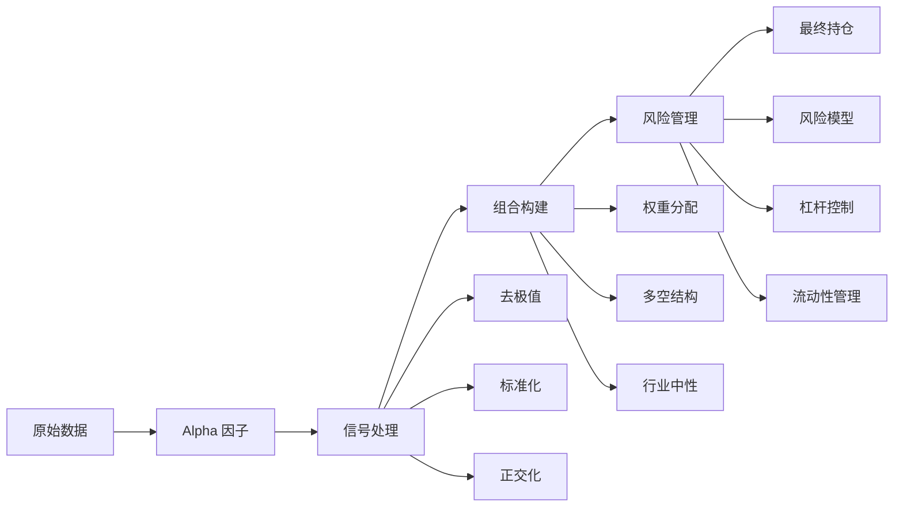

# 信号到组合

> 将 Alpha 信号转化为实际可交易的投资组合

## 学习目标

- 理解从信号到持仓的完整转换流程
- 掌握组合构建的核心方法
- 学会风险管理的基本技术
- 了解回测框架和绩效评估

## 一、从信号到组合的完整链路



## 二、信号预处理

原始信号需要经过一系列处理才能用于组合构建。

### 2.1 去极值 (Outlier Removal)

极端值会扭曲组合权重，需要处理。

```python
import numpy as np
import pandas as pd
import matplotlib.pyplot as plt

def winsorize(series, lower_quantile=0.05, upper_quantile=0.95):
    """
    去极值（缩尾处理）

    将超过上下分位数的值替换为分位数值

    参数:
        series: 输入序列
        lower_quantile: 下分位数
        upper_quantile: 上分位数

    返回:
        去极值后的序列
    """
    lower_bound = series.quantile(lower_quantile)
    upper_bound = series.quantile(quantile=upper_quantile)

    return series.clip(lower=lower_bound, upper=upper_bound)


def mad_outlier_removal(series, threshold=3):
    """
    MAD (Median Absolute Deviation) 去极值

    比标准差更鲁棒的方法

    参数:
        series: 输入序列
        threshold: MAD 倍数阈值

    返回:
        去极值后的序列
    """
    median = series.median()
    mad = np.abs(series - median).median()

    # 定义异常值边界
    lower_bound = median - threshold * mad
    upper_bound = median + threshold * mad

    return series.clip(lower=lower_bound, upper=upper_bound)


# 演示去极值效果
np.random.seed(42)
# 生成带极端值的信号
signal_clean = np.random.normal(0, 1, 1000)
signal_with_outliers = signal_clean.copy()
signal_with_outliers[::50] += np.random.choice([10, -10], 20)  # 添加极端值

signal_series = pd.Series(signal_with_outliers)

# 应用去极值
winsorized = winsorize(signal_series, 0.05, 0.95)
mad_cleaned = mad_outlier_removal(signal_series, threshold=3)

# 可视化
fig, axes = plt.subplots(1, 3, figsize=(15, 4))

axes[0].hist(signal_series, bins=50, alpha=0.7, color='red', edgecolor='black')
axes[0].set_title('原始信号（含极端值）')
axes[0].set_xlabel('Signal Value')

axes[1].hist(winsorized, bins=50, alpha=0.7, color='steelblue', edgecolor='black')
axes[1].set_title('缩尾处理')
axes[1].set_xlabel('Signal Value')

axes[2].hist(mad_cleaned, bins=50, alpha=0.7, color='green', edgecolor='black')
axes[2].set_title('MAD 去极值')
axes[2].set_xlabel('Signal Value')

for ax in axes:
    ax.set_ylabel('Frequency')
    ax.grid(True, alpha=0.3)

plt.tight_layout()
plt.show()
```

### 2.2 标准化 (Standardization)

不同因子的尺度不同，需要统一。

```python
def zscore_standardize(series):
    """
    Z-score 标准化

    转换后均值为0，标准差为1
    """
    return (series - series.mean()) / series.std()


def rank_standardize(series):
    """
    排名标准化

    转换后均匀分布在 [-1, 1]
    """
    rank = series.rank(pct=True)
    return 2 * rank - 1


def min_max_normalize(series):
    """
    Min-Max 归一化

    转换后范围在 [0, 1]
    """
    return (series - series.min()) / (series.max() - series.min())


# 演示标准化方法
fig, axes = plt.subplots(2, 2, figsize=(12, 8))

# 原始信号
raw = pd.Series(np.random.normal(50, 20, 1000))
axes[0, 0].hist(raw, bins=30, alpha=0.7, edgecolor='black')
axes[0, 0].set_title(f'原始信号\n均值={raw.mean():.2f}, 标准差={raw.std():.2f}')

# Z-score
z_score = zscore_standardize(raw)
axes[0, 1].hist(z_score, bins=30, alpha=0.7, color='steelblue', edgecolor='black')
axes[0, 1].set_title(f'Z-score 标准化\n均值={z_score.mean():.2f}, 标准差={z_score.std():.2f}')

# 排名
ranked = rank_standardize(raw)
axes[1, 0].hist(ranked, bins=30, alpha=0.7, color='green', edgecolor='black')
axes[1, 0].set_title(f'排名标准化\n范围=[{ranked.min():.2f}, {ranked.max():.2f}]')

# Min-Max
min_max = min_max_normalize(raw)
axes[1, 1].hist(min_max, bins=30, alpha=0.7, color='orange', edgecolor='black')
axes[1, 1].set_title(f'Min-Max 归一化\n范围=[{min_max.min():.2f}, {min_max.max():.2f}]')

for ax in axes.flat:
    ax.set_ylabel('Frequency')
    ax.grid(True, alpha=0.3)

plt.tight_layout()
plt.show()
```

### 2.3 因子正交化 (Orthogonalization)

消除因子之间的相关性，避免重复暴露。

```python
def orthogonalize(factor, industry_returns, market_returns=None):
    """
    因子正交化

    从因子中剔除行业和市场影响

    参数:
        factor: 原始因子
        industry_returns: 行业收益率矩阵
        market_returns: 市场收益率（可选）

    返回:
        正交化后的因子
    """
    from sklearn.linear_model import LinearRegression

    # 准备回归变量
    X = industry_returns.copy()
    if market_returns is not None:
        X['market'] = market_returns

    # 对齐数据
    df = pd.DataFrame({'factor': factor}).join(X, how='inner').dropna()

    if df.empty:
        return factor

    y = df['factor'].values
    X_reg = df.drop('factor', axis=1).values

    # 回归
    model = LinearRegression()
    model.fit(X_reg, y)

    # 残差 = 正交化因子
    residuals = y - model.predict(X_reg)

    return pd.Series(residuals, index=df.index)


# 演示正交化效果
np.random.seed(42)
n_assets = 100
n_periods = 500

# 生成原始因子（受行业影响）
industry_factor = np.random.choice([1, 2, 3], n_assets)
raw_factor = np.random.normal(0, 1, n_assets) + industry_factor * 0.5

# 行业收益率
industry_returns = pd.DataFrame({
    'Ind1': np.random.normal(0.001, 0.02, n_periods),
    'Ind2': np.random.normal(0.001, 0.02, n_periods),
    'Ind3': np.random.normal(0.001, 0.02, n_periods),
})

# 模拟正交化（简化示例）
# 实际应用中需要按资产匹配行业
orthogonalized = raw_factor - np.mean(raw_factor)  # 简化：中心化

fig, axes = plt.subplots(1, 2, figsize=(12, 4))

axes[0].scatter(industry_factor, raw_factor, alpha=0.6)
axes[0].set_title('原始因子 vs 行业\n有明显相关性')
axes[0].set_xlabel('Industry')
axes[0].set_ylabel('Factor Value')

axes[1].scatter(industry_factor, orthogonalized - np.mean(orthogonalized), alpha=0.6)
axes[1].set_title('正交化因子 vs 行业\n相关性被剔除')
axes[1].set_xlabel('Industry')
axes[1].set_ylabel('Orthogonalized Factor')

for ax in axes:
    ax.grid(True, alpha=0.3)

plt.tight_layout()
plt.show()
```

---

## 三、组合构建方法

### 3.1 等权组合 (Equal Weight)

最简单的方法：

```python
def equal_weight_portfolio(signal, top_n=50, bottom_n=50):
    """
    等权多空组合

    参数:
        signal: 信号 Series（排名后的）
        top_n: 做多头数
        bottom_n: 做空头数

    返回:
        weights: 权重 Series
    """
    weights = pd.Series(0, index=signal.index)

    # 排名
    ranked = signal.rank(ascending=True)

    # 做多：信号最强的
    longs = ranked[ranked >= (len(ranked) - top_n + 1)].index
    weights[longs] = 1 / top_n

    # 做空：信号最弱的
    shorts = ranked[ranked <= bottom_n].index
    weights[shorts] = -1 / bottom_n

    return weights


# 演示
np.random.seed(42)
n_assets = 100
signal = pd.Series(
    np.random.normal(0, 1, n_assets),
    index=[f'Stock_{i:03d}' for i in range(n_assets)]
)

weights_eq = equal_weight_portfolio(signal, top_n=20, bottom_n=20)

print(f"多头数量: {(weights_eq > 0).sum()}")
print(f"空头数量: {(weights_eq < 0).sum()}")
print(f"多头权重: {weights_eq[weights_eq > 0].sum():.2f}")
print(f"空头权重: {weights_eq[weights_eq < 0].sum():.2f}")
```

### 3.2 信号加权 (Signal-Weighted)

根据信号强度分配权重：

```python
def signal_weighted_portfolio(signal, leverage=1.0, long_only=False):
    """
    信号加权组合

    参数:
        signal: 标准化后的信号
        leverage: 杠杆倍数
        long_only: 是否只做多

    返回:
        weights: 权重 Series
    """
    # Z-score 标准化
    z_score = (signal - signal.mean()) / signal.std()

    if long_only:
        # 只做多：负信号转为0
        z_score = z_score.clip(lower=0)

    # 计算权重
    raw_weights = leverage * z_score / z_score.abs().sum()

    return raw_weights


# 演示
weights_sig = signal_weighted_portfolio(signal, leverage=2.0)

fig, axes = plt.subplots(1, 2, figsize=(14, 4))

# 信号分布
axes[0].hist(signal, bins=30, alpha=0.7, edgecolor='black')
axes[0].set_title('信号分布')
axes[0].set_xlabel('Signal Value')
axes[0].set_ylabel('Count')

# 权重分布
axes[1].bar(range(len(weights_sig)), weights_sig.sort_values().values)
axes[1].set_title('权重分布（按信号排序）')
axes[1].set_xlabel('Rank')
axes[1].set_ylabel('Weight')

for ax in axes:
    ax.grid(True, alpha=0.3)

plt.tight_layout()
plt.show()
```

### 3.3 分层组合 (Stratified Portfolio)

先按因子分组，再在各组内选股：

```python
def stratified_portfolio(signal, n_strata=5, top_per_stratum=5):
    """
    分层组合

    步骤：
    1. 按信号分成 n_strata 层
    2. 每层选 top_per_stratum 个
    3. 等权配置

    参数:
        signal: 信号
        n_strata: 分层数
        top_per_stratum: 每层选多少

    返回:
        weights: 权重 Series
    """
    # 计算分位数
    quantiles = pd.qcut(signal, n_strata, labels=False, duplicates='drop')

    weights = pd.Series(0, index=signal.index)
    selected_stocks = []

    # 每层内选择信号最强的
    for stratum in range(n_strata):
        stratum_mask = quantiles == stratum
        stratum_stocks = signal[stratum_mask]

        # 该层内排名
        stratum_rank = stratum_stocks.rank(ascending=False)

        # 选择该层最强的
        top_in_stratum = stratum_rank[stratum_rank <= top_per_stratum].index
        selected_stocks.extend(top_in_stratum)

    # 等权分配
    n_selected = len(selected_stocks)
    weights[selected_stocks] = 1 / n_selected

    return weights, quantiles


# 演示
weights_strat, quantiles = stratified_portfolio(signal, n_strata=5, top_per_stratum=5)

# 可视化分层
fig, axes = plt.subplots(1, 2, figsize=(14, 4))

# 分层效果
strata_counts = pd.Series(quantiles).value_counts().sort_index()
axes[0].bar(strata_counts.index, strata_counts.values)
axes[0].set_title('各层股票数量')
axes[0].set_xlabel('Stratum')
axes[0].set_ylabel('Count')

# 被选中股票的分布
selected_quantiles = pd.Series(quantiles[weights_strat > 0])
axes[1].hist(selected_quantiles, bins=np.arange(0, 6) - 0.5, edgecolor='black')
axes[1].set_title('被选中股票的分层分布')
axes[1].set_xlabel('Stratum')
axes[1].set_ylabel('Count')
axes[1].set_xticks(range(5))

for ax in axes:
    ax.grid(True, alpha=0.3)

plt.tight_layout()
plt.show()
```

### 3.4 风险平价 (Risk Parity)

基于风险贡献分配权重：

```python
def risk_parity_weights(covariance_matrix, target_risk_contrib=None):
    """
    风险平价权重

    使每个资产对组合风险的贡献相等

    参数:
        covariance_matrix: 协方差矩阵
        target_risk_contrib: 目标风险贡献（默认等贡献）

    返回:
        weights: 权重向量
    """
    n = covariance_matrix.shape[0]

    # 简化方法：使用迭代
    weights = np.ones(n) / n  # 初始化等权

    for _ in range(100):  # 迭代优化
        # 计算组合波动率
        portfolio_var = weights @ covariance_matrix @ weights
        marginal_contrib = covariance_matrix @ weights
        risk_contrib = weights * marginal_contrib / portfolio_var

        # 调整权重
        new_weights = 1 / (marginal_contrib / np.sqrt(portfolio_var))
        weights = new_weights / new_weights.sum()

    return pd.Series(weights, index=covariance_matrix.index)


# 演示
np.random.seed(42)
n_assets = 10

# 生成协方差矩阵
returns = pd.DataFrame(
    np.random.multivariate_normal(
        np.zeros(n_assets),
        np.eye(n_assets) * 0.01 + np.full((n_assets, n_assets), 0.002),
        100
    ),
    columns=[f'Stock_{i}' for i in range(n_assets)]
)

cov_matrix = returns.cov()

weights_rp = risk_parity_weights(cov_matrix)

print("风险平价权重:")
print(weights_rp.round(4))
```

---

## 四、风险管理

### 4.1 行业中性化

消除行业暴露：

```python
def industry_neutral_weights(signal, industry_mapping, method='residual'):
    """
    行业中性权重

    参数:
        signal: 股票信号
        industry_mapping: 股票到行业的映射
        method: 'residual' 或 'stratified'

    返回:
        weights: 行业中性权重
    """
    if method == 'residual':
        # 回归法：从信号中剔除行业影响
        industries = pd.get_dummies(industry_mapping)

        # 对齐
        df = pd.DataFrame({'signal': signal}).join(industries, how='inner').dropna()

        from sklearn.linear_model import LinearRegression
        X = df.drop('signal', axis=1)
        y = df['signal']

        model = LinearRegression()
        model.fit(X, y)

        # 残差作为新信号
        residual_signal = y - model.predict(X)

        # 基于残差信号构建权重
        z_score = (residual_signal - residual_signal.mean()) / residual_signal.std()
        weights = z_score / z_score.abs().sum()

        return weights

    elif method == 'stratified':
        # 分层法：每个行业内分别构建权重
        weights = pd.Series(0, index=signal.index)

        for industry in industry_mapping.unique():
            industry_stocks = industry_mapping[industry_mapping == industry].index
            industry_signal = signal[industry_stocks]

            # 行业内等权
            n_long = max(1, len(industry_stocks) // 3)
            top_stocks = industry_signal.nlargest(n_long).index
            weights[top_stocks] = 1 / (n_long * len(industry_mapping.unique()))

        return weights


# 演示
np.random.seed(42)
industries = ['Tech', 'Finance', 'Health', 'Energy', 'Consumer']
n_per_industry = 20

stock_list = []
industry_list = []
for ind in industries:
    for i in range(n_per_industry):
        stock_list.append(f'{ind}_{i}')
        industry_list.append(ind)

signal_demo = pd.Series(
    np.random.normal(0, 1, len(stock_list)),
    index=stock_list
)
industry_mapping = pd.Series(industry_list, index=stock_list)

# 行业中性化
weights_neutral = industry_neutral_weights(signal_demo, industry_mapping, method='stratified')

# 检查行业暴露
industry_exposure = pd.DataFrame({
    'Industry': industry_mapping,
    'Weight': weights_neutral
}).groupby('Industry')['Weight'].sum()

print("行业暴露:")
print(industry_exposure.round(4))
print(f"\n目标：各行业暴露应接近 1/{len(industries)} = {1/len(industries):.4f}")
```

### 4.2 波动率控制

```python
def volatility_target_weights(weights, returns, target_vol=0.15):
    """
    波动率目标调整

    参数:
        weights: 原始权重
        returns: 历史收益率
        target_vol: 目标年化波动率

    返回:
        adjusted_weights: 调整后权重
    """
    # 计算组合波动率
    portfolio_return = (returns * weights).sum(axis=1)
    current_vol = portfolio_return.std() * np.sqrt(252)

    # 缩放因子
    scale_factor = target_vol / current_vol if current_vol > 0 else 1

    # 限制最大杠杆
    scale_factor = min(scale_factor, 3.0)  # 最大3倍杠杆

    return weights * scale_factor
```

### 4.3 流动性管理

```python
def liquidity_adjusted_weights(signal, volumes, max_turnover=0.2, max_pct_volume=0.1):
    """
    流动性调整权重

    参数:
        signal: 信号
        volumes: 成交量 DataFrame
        max_turnover: 最大换手率
        max_pct_volume: 单只股票最大占日成交量比例

    返回:
        weights: 调整后权重
    """
    # 转换信号为初步权重
    raw_weights = signal_weighted_portfolio(signal)

    # 计算交易金额（简化）
    avg_volume = volumes.mean()

    # 限制单只股票权重
    max_weights = avg_volume * max_pct_volume / (avg_volume.sum())

    # 应用流动性约束
    adjusted_weights = raw_weights.clip(lower=max_weights * -1, upper=max_weights)

    # 重新标准化
    adjusted_weights = adjusted_weights / adjusted_weights.abs().sum()

    return adjusted_weights
```

---

## 五、完整回测框架

```python
import numpy as np
import pandas as pd
from typing import Callable, Dict, List, Optional, Tuple
import matplotlib.pyplot as plt

class BacktestEngine:
    """
    量化策略回测引擎

    功能：
    1. 信号生成
    2. 组合构建
    3. 风险管理
    4. 绩效评估
    """

    def __init__(self, initial_capital: float = 1000000):
        """
        初始化回测引擎

        参数:
            initial_capital: 初始资金
        """
        self.initial_capital = initial_capital
        self.signals = None
        self.weights = None
        self.returns = None
        self.portfolio_value = None
        self.performance = {}
        self.trade_log = []

    def generate_signals(self,
                        factor_data: pd.DataFrame,
                        signal_func: Callable) -> pd.DataFrame:
        """
        生成交易信号

        参数:
            factor_data: 因子数据 (时间 x 资产)
            signal_func: 信号生成函数

        返回:
            signals: 信号 DataFrame
        """
        self.signals = signal_func(factor_data)
        return self.signals

    def build_portfolio(self,
                       signals: pd.DataFrame,
                       rebalance_freq: str = 'M',
                       build_func: Optional[Callable] = None,
                       **build_params) -> pd.DataFrame:
        """
        构建投资组合

        参数:
            signals: 信号 DataFrame
            rebalance_freq: 调仓频率 ('D'=日, 'W'=周, 'M'=月)
            build_func: 组合构建函数
            **build_params: 构建函数参数

        返回:
            weights: 权重 DataFrame
        """
        if build_func is None:
            build_func = equal_weight_portfolio

        # 确定调仓日
        if rebalance_freq == 'D':
            rebalance_dates = signals.index
        elif rebalance_freq == 'W':
            rebalance_dates = signals.resample('W').last().index
        elif rebalance_freq == 'M':
            rebalance_dates = signals.resample('M').last().index
        else:
            raise ValueError(f"不支持的调仓频率: {rebalance_freq}")

        # 构建权重矩阵
        self.weights = pd.DataFrame(0, index=signals.index, columns=signals.columns)

        for date in rebalance_dates:
            if date in signals.index:
                current_signal = signals.loc[date].dropna()

                if len(current_signal) > 0:
                    # 构建权重
                    new_weights = build_func(current_signal, **build_params)

                    # 填充到下一个调仓日
                    next_date = signals.index[signals.index.get_loc(date) + 1] \
                        if signals.index.get_loc(date) + 1 < len(signals) else signals.index[-1]

                    if rebalance_freq == 'D':
                        self.weights.loc[date, new_weights.index] = new_weights.values
                    else:
                        # 找到下一个调仓日
                        current_idx = signals.index.get_loc(date)
                        next_idx = min([signals.index.get_loc(d) for d in rebalance_dates
                                       if d > date] + [len(signals) - 1])

                        self.weights.iloc[current_idx:next_idx, self.weights.columns.isin(new_weights.index)] = \
                            self.weights.iloc[current_idx:next_idx,
                                               self.weights.columns.isin(new_weights.index)].add(
                                new_weights.values, fill_value=0
                            )

        return self.weights

    def run_backtest(self,
                     prices: pd.DataFrame,
                     transaction_cost: float = 0.001) -> pd.Series:
        """
        运行回测

        参数:
            prices: 价格数据
            transaction_cost: 交易成本（双边）

        返回:
            portfolio_returns: 组合收益序列
        """
        if self.weights is None:
            raise ValueError("请先构建投资组合")

        # 计算收益率
        asset_returns = prices.pct_change()

        # 组合收益（t-1日的权重 × t日的收益率）
        self.returns = (self.weights.shift(1) * asset_returns).sum(axis=1)

        # 计算交易成本
        weight_changes = self.weights.diff().abs().sum(axis=1)
        cost = weight_changes * transaction_cost

        # 扣除成本
        self.returns = self.returns - cost

        # 计算组合价值
        self.portfolio_value = self.initial_capital * (1 + self.returns).cumprod()

        # 计算绩效
        self._calculate_performance()

        return self.returns

    def _calculate_performance(self):
        """计算绩效指标"""
        if self.returns is None:
            return

        returns = self.returns.dropna()

        # 年化收益
        annual_return = (1 + returns).mean() * 252

        # 年化波动率
        annual_vol = returns.std() * np.sqrt(252)

        # 夏普比率（假设无风险利率为0）
        sharpe_ratio = annual_return / annual_vol if annual_vol > 0 else 0

        # 最大回撤
        cumulative = (1 + self.returns).cumprod()
        running_max = cumulative.expanding().max()
        drawdown = (cumulative - running_max) / running_max
        max_drawdown = drawdown.min()

        # 胜率
        win_rate = (returns > 0).sum() / len(returns)

        # 收益回撤比
        return_drawdown_ratio = annual_return / abs(max_drawdown) if max_drawdown != 0 else 0

        self.performance = {
            'total_return': cumulative.iloc[-1] - 1,
            'annual_return': annual_return,
            'annual_volatility': annual_vol,
            'sharpe_ratio': sharpe_ratio,
            'max_drawdown': max_drawdown,
            'win_rate': win_rate,
            'return_drawdown_ratio': return_drawdown_ratio
        }

    def plot_results(self, benchmark: Optional[pd.Series] = None):
        """
        可视化回测结果

        参数:
            benchmark: 基准收益序列（可选）
        """
        if self.portfolio_value is None:
            raise ValueError("请先运行回测")

        fig, axes = plt.subplots(3, 1, figsize=(14, 10))

        # 1. 组合价值
        axes[0].plot(self.portfolio_value.index, self.portfolio_value.values,
                     label='Strategy', linewidth=2, color='steelblue')

        if benchmark is not None:
            benchmark_value = self.initial_capital * (1 + benchmark).cumprod()
            axes[0].plot(benchmark_value.index, benchmark_value.values,
                         label='Benchmark', linewidth=2, alpha=0.7)

        axes[0].set_title('Portfolio Value')
        axes[0].set_ylabel('Value ($)')
        axes[0].legend()
        axes[0].grid(True, alpha=0.3)

        # 2. 累计收益
        cumulative_returns = (1 + self.returns).cumprod()
        axes[1].plot(cumulative_returns.index, cumulative_returns.values,
                     linewidth=2, color='darkgreen')
        axes[1].set_title('Cumulative Returns')
        axes[1].set_ylabel('Cumulative Return')
        axes[1].grid(True, alpha=0.3)

        # 3. 回撤
        running_max = cumulative_returns.expanding().max()
        drawdown = (cumulative_returns - running_max) / running_max
        axes[1].fill_between(drawdown.index, 0, drawdown.values, alpha=0.3, color='red')
        axes[2].plot(drawdown.index, drawdown.values, color='red', linewidth=1.5)
        axes[2].set_title('Drawdown')
        axes[2].set_ylabel('Drawdown')
        axes[2].set_xlabel('Date')
        axes[2].fill_between(drawdown.index, drawdown.values, 0, alpha=0.3, color='red')
        axes[2].grid(True, alpha=0.3)

        # 添加绩效信息
        perf_text = f"""
        Performance Metrics:
        ──────────────────────────────────────
        总收益:        {self.performance['total_return']:>8.2%}
        年化收益:      {self.performance['annual_return']:>8.2%}
        年化波动率:    {self.performance['annual_volatility']:>8.2%}
        夏普比率:      {self.performance['sharpe_ratio']:>8.2f}
        最大回撤:      {self.performance['max_drawdown']:>8.2%}
        胜率:          {self.performance['win_rate']:>8.2%}
        收益回撤比:    {self.performance['return_drawdown_ratio']:>8.2f}
        """

        axes[2].text(0.02, 0.15, perf_text, transform=axes[2].transAxes,
                    fontsize=9, verticalalignment='top',
                    bbox=dict(boxstyle='round', facecolor='wheat', alpha=0.7),
                    family='monospace')

        plt.tight_layout()
        plt.show()

        return fig

    def print_report(self):
        """打印绩效报告"""
        if not self.performance:
            print("绩效数据不可用")
            return

        print("=" * 60)
        print("回测绩效报告")
        print("=" * 60)
        print(f"初始资金: ${self.initial_capital:,.2f}")
        print(f"最终资金: ${self.portfolio_value.iloc[-1]:,.2f}")
        print("-" * 60)
        for key, value in self.performance.items():
            if 'rate' in key or 'return' in key or 'drawdown' in key:
                print(f"{key:20s}: {value:>8.2%}")
            else:
                print(f"{key:20s}: {value:>8.4f}")
        print("=" * 60)


# ============ 使用示例 ============

def momentum_signal(factor_data: pd.DataFrame, lookback: int = 20) -> pd.DataFrame:
    """
    动量信号生成函数

    参数:
        factor_data: 价格数据
        lookback: 回看期

    返回:
        signals: 信号 DataFrame
    """
    # 计算过去收益率
    momentum = factor_data.pct_change(lookback)
    return momentum


# 模拟数据
np.random.seed(42)
n_assets = 50
n_periods = 500

dates = pd.date_range('2023-01-01', periods=n_periods, freq='D')
assets = [f'Stock_{i:03d}' for i in range(n_assets)]

# 生成价格数据
returns = pd.DataFrame(
    np.random.multivariate_normal(
        np.zeros(n_assets),
        np.eye(n_assets) * 0.0004 + np.full((n_assets, n_assets), 0.00005),
        n_periods
    ),
    index=dates,
    columns=assets
)

prices = 100 * (1 + returns).cumprod()

# 添加一些动量效应
for i in range(50, n_periods):
    momentum_factor = np.random.uniform(-0.02, 0.02, n_assets)
    returns.iloc[i] += momentum_factor * 0.3
    prices.iloc[i] = prices.iloc[i-1] * (1 + returns.iloc[i])

# 运行回测
engine = BacktestEngine(initial_capital=1000000)

# 生成信号
signals = engine.generate_signals(prices, momentum_signal)

# 构建组合
engine.build_portfolio(
    signals,
    rebalance_freq='M',
    build_func=signal_weighted_portfolio,
    leverage=1.5
)

# 运行回测
portfolio_returns = engine.run_backtest(prices, transaction_cost=0.001)

# 可视化
engine.plot_results(benchmark=returns.mean(axis=1))

# 打印报告
engine.print_report()
```

---

## 六、绩效评估指标详解

### 6.1 收益指标

```python
def calculate_return_metrics(returns: pd.Series, benchmark_returns: pd.Series = None) -> dict:
    """
    计算收益相关指标

    参数:
        returns: 策略收益
        benchmark_returns: 基准收益

    返回:
        metrics: 指标字典
    """
    metrics = {}

    # 累计收益
    metrics['cumulative_return'] = (1 + returns).prod() - 1

    # 年化收益
    metrics['annual_return'] = (1 + returns).mean() * 252

    # 月度收益
    monthly_returns = returns.resample('M').apply(lambda x: (1 + x).prod() - 1)
    metrics['avg_monthly_return'] = monthly_returns.mean()

    # 超额收益（如果有基准）
    if benchmark_returns is not None:
        aligned_returns = returns.align(benchmark_returns, join='inner')
        excess_returns = aligned_returns[0] - aligned_returns[1]
        metrics['excess_return'] = excess_returns.mean() * 252

    return metrics
```

### 6.2 风险指标

```python
def calculate_risk_metrics(returns: pd.Series, benchmark_returns: pd.Series = None) -> dict:
    """
    计算风险相关指标
    """
    metrics = {}

    # 波动率
    metrics['annual_volatility'] = returns.std() * np.sqrt(252)

    # 下行波动率（只看负收益）
    negative_returns = returns[returns < 0]
    metrics['downside_volatility'] = negative_returns.std() * np.sqrt(252) if len(negative_returns) > 0 else 0

    # 最大回撤
    cumulative = (1 + returns).cumprod()
    running_max = cumulative.expanding().max()
    drawdown = (cumulative - running_max) / running_max
    metrics['max_drawdown'] = drawdown.min()

    # Calmar 比率（年化收益/最大回撤）
    annual_return = (1 + returns).mean() * 252
    metrics['calmar_ratio'] = annual_return / abs(metrics['max_drawdown']) if metrics['max_drawdown'] != 0 else 0

    # VaR (Value at Risk) - 95% 置信度
    metrics['var_95'] = returns.quantile(0.05)

    # CVaR (Conditional VaR) - 超过 VaR 的平均损失
    metrics['cvar_95'] = returns[returns <= metrics['var_95']].mean()

    # Beta (如果有基准)
    if benchmark_returns is not None:
        aligned_returns = returns.align(benchmark_returns, join='inner')
        covariance = aligned_returns[0].cov(aligned_returns[1])
        benchmark_var = aligned_returns[1].var()
        metrics['beta'] = covariance / benchmark_var if benchmark_var > 0 else 0

        # 跟踪误差
        metrics['tracking_error'] = (aligned_returns[0] - aligned_returns[1]).std() * np.sqrt(252)

    return metrics
```

### 6.3 风险调整收益指标

```python
def calculate_risk_adjusted_metrics(returns: pd.Series,
                                     benchmark_returns: pd.Series = None,
                                     risk_free_rate: float = 0.03) -> dict:
    """
    计算风险调整收益指标
    """
    metrics = {}

    annual_return = (1 + returns).mean() * 252
    annual_vol = returns.std() * np.sqrt(252)

    # 夏普比率
    metrics['sharpe_ratio'] = (annual_return - risk_free_rate) / annual_vol if annual_vol > 0 else 0

    # Sortino 比率（使用下行波动率）
    negative_returns = returns[returns < 0]
    downside_vol = negative_returns.std() * np.sqrt(252) if len(negative_returns) > 0 else 0.01
    metrics['sortino_ratio'] = (annual_return - risk_free_rate) / downside_vol

    # 信息比率（如果有基准）
    if benchmark_returns is not None:
        aligned_returns = returns.align(benchmark_returns, join='inner')
        excess_returns = aligned_returns[0] - aligned_returns[1]
        metrics['information_ratio'] = excess_returns.mean() * 252 / (excess_returns.std() * np.sqrt(252))

    return metrics
```

### 6.4 稳定性指标

```python
def calculate_stability_metrics(returns: pd.Series) -> dict:
    """
    计算策略稳定性指标
    """
    metrics = {}

    # 胜率
    metrics['win_rate'] = (returns > 0).sum() / len(returns)

    # 盈亏比
    winning_returns = returns[returns > 0]
    losing_returns = returns[returns < 0]
    avg_win = winning_returns.mean() if len(winning_returns) > 0 else 0
    avg_loss = abs(losing_returns.mean()) if len(losing_returns) > 0 else 0.01
    metrics['win_loss_ratio'] = avg_win / avg_loss

    # 最大连续亏损天数
    cumsum = np.where(returns > 0, 1, -1)
    max_consecutive_losses = 0
    current_consecutive = 0
    for val in cumsum:
        if val == -1:
            current_consecutive += 1
            max_consecutive_losses = max(max_consecutive_losses, current_consecutive)
        else:
            current_consecutive = 0
    metrics['max_consecutive_losses'] = max_consecutive_losses

    # 收益标准差（月度）
    monthly_returns = returns.resample('M').apply(lambda x: (1 + x).prod() - 1)
    metrics['monthly_return_std'] = monthly_returns.std()

    return metrics
```

---

## 七、高级组合技术

### 7.1 Black-Litterman 模型

结合市场观点和均衡收益：

```python
def black_litterman(returns: pd.DataFrame,
                   market_caps: pd.Series,
                   views: np.ndarray,
                   view_uncertainty: np.ndarray,
                   tau: float = 0.05) -> pd.Series:
    """
    Black-Litterman 模型

    参数:
        returns: 历史收益率
        market_caps: 市值权重
        views: 观点矩阵 (P)
        view_uncertainty: 观点不确定性矩阵 (Ω)
        tau: 缩放参数

    返回:
        bl_weights: BL 权重
    """
    # 历史协方差
    cov_matrix = returns.cov()

    # 市场权重
    w_market = market_caps / market_caps.sum()

    # 均衡收益（隐含收益）
    # Π = λ * Σ * w_market, λ = risk_aversion
    risk_aversion = 3  # 假设风险厌恶系数
    implied_returns = risk_aversion * cov_matrix @ w_market

    # BL 公式
    # μ_BL = [(τΣ)^{-1} + P'Ω^{-1}P]^{-1} * [(τΣ)^{-1}Π + P'Ω^{-1}Q]
    # 其中 Q 是观点收益向量

    # 简化实现
    tau_sigma = tau * cov_matrix
    inv_tau_sigma = np.linalg.inv(tau_sigma.values)
    inv_omega = np.linalg.inv(view_uncertainty)

    # 观点收益（简化：假设为零）
    Q = np.zeros(len(views))

    # 计算 BL 收益
    M1 = inv_tau_sigma + views.T @ inv_omega @ views
    M2 = inv_tau_sigma @ implied_returns.values + views.T @ inv_omega @ Q

    bl_returns = np.linalg.inv(M1) @ M2

    # 转换为权重
    bl_weights = pd.Series(
        np.linalg.inv(cov_matrix.values) @ bl_returns / risk_aversion,
        index=returns.columns
    )

    # 标准化为正权重
    bl_weights = bl_weights.clip(lower=0)
    bl_weights = bl_weights / bl_weights.sum()

    return bl_weights
```

### 7.2 风险因子模型

```python
def factor_model_exposures(returns: pd.DataFrame,
                          factor_returns: pd.DataFrame) -> pd.DataFrame:
    """
    因子暴露计算

    参数:
        returns: 资产收益率
        factor_returns: 因子收益率

    返回:
        factor_loadings: 因子载荷
    """
    from sklearn.linear_model import LinearRegression

    factor_loadings = pd.DataFrame(index=returns.columns, columns=factor_returns.columns)

    for asset in returns.columns:
        model = LinearRegression()
        model.fit(factor_returns, returns[asset])
        factor_loadings.loc[asset] = model.coef_

    return factor_loadings
```

---

## 核心知识点总结

### 信号处理
- **去极值**：缩尾处理、MAD 方法
- **标准化**：Z-score、排名标准化
- **正交化**：剔除行业、市场影响

### 组合构建
- **等权**：简单但有效
- **信号加权**：根据信号强度分配
- **分层组合**：风险分散
- **风险平价**：基于风险贡献

### 风险管理
- **行业中性**：消除行业暴露
- **波动率控制**：目标波动率
- **流动性管理**：限制换手率

### 绩效评估
- **收益指标**：累计、年化、超额收益
- **风险指标**：波动率、回撤、VaR
- **风险调整收益**：夏普、Sortino、信息比率
- **稳定性指标**：胜率、盈亏比、最大连续亏损

### 回测要点
- 前视偏差避免
- 交易成本考虑
- 流动性约束
- 样本内外验证

## 模块总结

本模块系统介绍了从 Alpha 信号到实际交易组合的完整链路：

1. **信号预处理**：去极值、标准化、正交化
2. **组合构建**：多种加权方法
3. **风险管理**：行业中性、波动率控制、流动性管理
4. **回测框架**：完整的回测引擎实现
5. **绩效评估**：全面的指标体系

完成本模块学习后，你应该能够：
- 将原始信号转化为可交易的投资组合
- 实现基本的风险管理
- 构建完整的回测系统
- 评估策略的真实表现

## 继续学习

策略研究模块完成！建议继续学习：
- [回测框架](../回测框架/)
- [风险管理](../风险管理/)
- [执行优化](../执行优化/)
