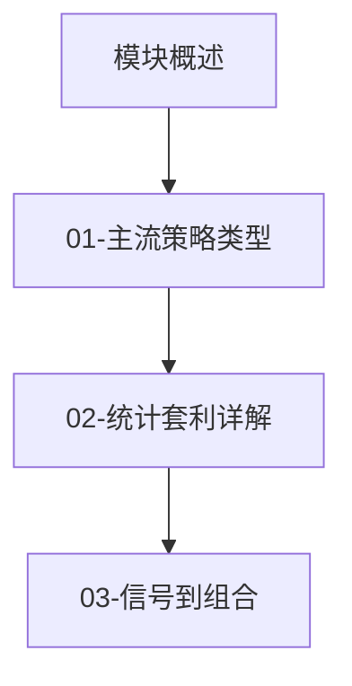
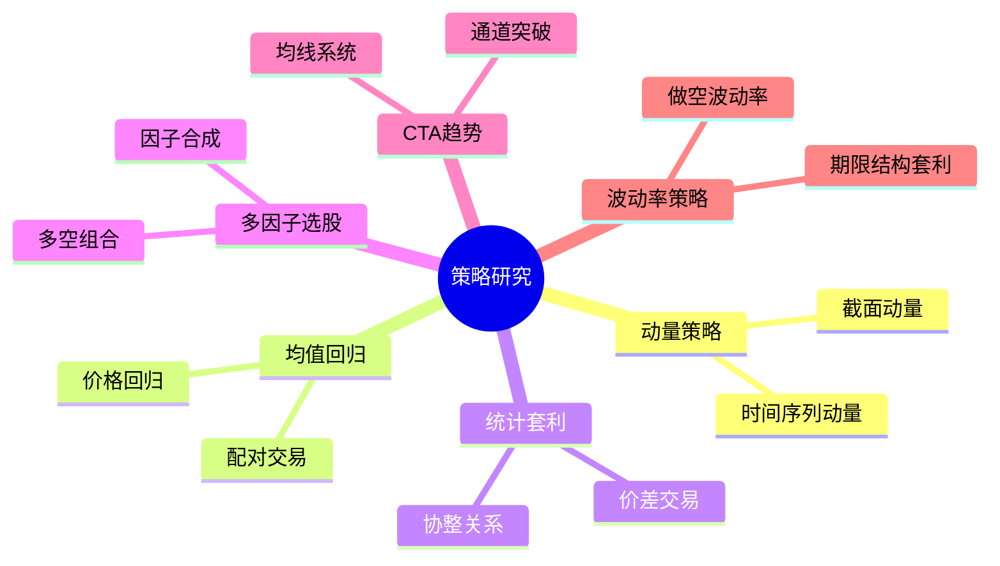

# 策略研究模块 (Strategy Research)

> 从 Alpha 信号到可交易策略的完整链路

## 模块简介

策略研究是量化交易的核心环节。如果说 alpha 研究是发现"预测信号"，那么策略研究就是将这些信号转化为可执行的交易方案。

本模块聚焦于：
- **主流策略类型**：系统梳理量化界经典策略框架
- **统计套利**：深入解析最经典的量化策略之一
- **信号到组合**：如何从 alpha 信号构建实际可交易的投资组合

## 学习目标

完成本模块后，你将能够：

1. **识别主流策略类型**：理解动量、均值回归、统计套利、多因子等策略的核心逻辑
2. **掌握协整分析**：从数学原理到 Python 实现，完整掌握配对交易的基础
3. **构建完整策略**：从数据获取到回测评估，形成可执行的策略代码
4. **理解策略风险**：知道每种策略的适用场景、容量限制和潜在风险
5. **ML 增强策略**：了解机器学习如何提升传统策略表现

## 前置知识

- [概率与统计基础](../概率统计/)
- [时间序列分析](../时间序列/)
- [Alpha 研究基础](../alpha研究/)（建议）

## 学习路径



## 文件导航

| 文件 | 内容 | 预计时间 | 难度 |
|------|------|----------|------|
| [01-主流策略类型.md](./01-主流策略类型.md) | 系统梳理量化主流策略类型 | 2-3h | ⭐⭐ |
| [02-统计套利详解.md](./02-统计套利详解.md) | 配对交易原理、协整检验、完整代码 | 3-4h | ⭐⭐⭐ |
| [03-信号到组合.md](./03-信号到组合.md) | 组合构建、风险管理、回测框架 | 2-3h | ⭐⭐⭐ |

**总预计学习时间**：6-8 小时

## 核心概念图谱



## 策略研究流程

一个完整的策略研究通常包含以下步骤：

```
┌─────────────────────────────────────────────────────────────┐
│                      策略研究流程                            │
├─────────────────────────────────────────────────────────────┤
│                                                             │
│  1. 策略构思        →  挖掘市场规律，形成交易假设            │
│                      (动量、均值回归、套利...)               │
│                                                             │
│  2. 信号设计        →  将规律转化为可计算的信号               │
│                      (Z-score、排名、交叉...)                │
│                                                             │
│  3. 组合构建        →  将信号转化为持仓                      │
│                      (权重分配、多头/空头组合)                │
│                                                             │
│  4. 风险管理        →  控制暴露、止损、仓位                  │
│                      (行业中性、市值中性、波动率控制)          │
│                                                             │
│  5. 回测评估        →  历史数据验证策略                      │
│                      (收益、回撤、夏普、换手)                 │
│                                                             │
│  6. 实盘验证        →  模拟交易、逐步放大                    │
│                      (滑点、冲击成本、市场微观结构)           │
│                                                             │
└─────────────────────────────────────────────────────────────┘
```

## 本模块特色

- **纯 Python 实现**：不依赖 qlib 或商业平台，使用 pandas/numpy/scipy
- **模拟数据驱动**：每个策略都配有可运行的模拟数据代码
- **从原理到代码**：先讲策略逻辑和数学原理，再给完整实现
- **实用导向**：聚焦实际可执行的策略，而非纯理论

## 开始学习

建议按顺序学习：
1. 先读 [01-主流策略类型.md](./01-主流策略类型.md) 了解全貌
2. 再深入 [02-统计套利详解.md](./02-统计套利详解.md) 掌握经典策略
3. 最后通过 [03-信号到组合.md](./03-信号到组合.md) 学会构建完整系统

让我们开始吧！
