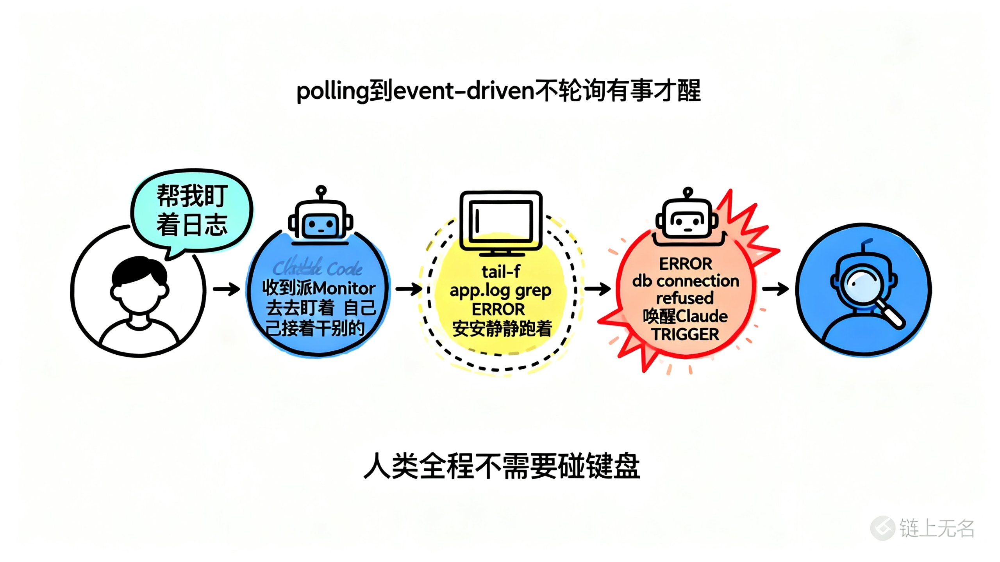
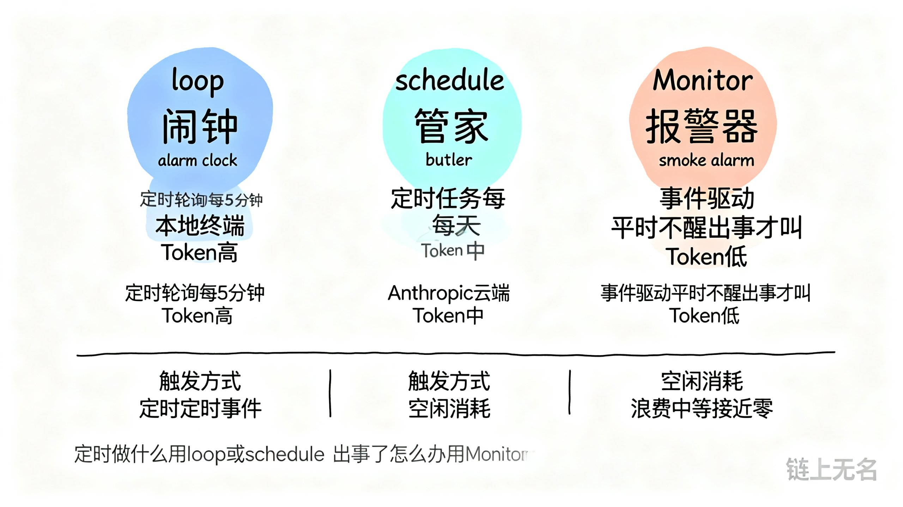

# Claude Code 推出 Monitor 功能，帮你随时盯梢


Claude Code 在 v2.1.98 里加了个功能叫 Monitor。能让 Agent 在后台挂一个监控脚本，有事才醒，没事不动。

## 先看效果

官方演示里，用户说了一句话：

> "我刚部署了 API，帮我监控一下日志里有没有报错。"

Claude 回了一句：「收到，我先派一个 Monitor 去盯着日志，自己接着干别的活。」

然后屏幕上出现了两个窗口。

左边是 Claude Code 的主界面，光标闪着，等你下一个指令。右边是个后台终端，跑着：

```
tail -f /var/log/app.log | grep --line-buffered ERROR
```

日志在右边不停滚。INFO、DEBUG、WARN……一切正常。

直到一行红色报错冒了出来：`ERROR db: connection refused to postgres:5432`

Monitor 立刻触发，左边弹一条黄色提示：「Monitor event — errors in app.log」。Claude 接着自动开始排查 Postgres 连接失败的原因。

从部署到发现问题到开始排查，人没碰一下键盘。

## 轮询的代价

想让 Claude Code 监控什么东西，之前只有一个办法：不停地问。

跑个测试？每隔几秒 `cat` 一下日志。等 CI 跑完？反复 `curl` 查状态。看 PR 有没有 review？隔一会儿 `gh pr view` 一次。要么就 `sleep 600 & ...`，600 还是 60，纯拍脑袋。

这就是轮询。polling。初级，难用。

长时间运行的 Agent 工作流里，光轮询就能吃掉 80% 以上的 token 预算。相当于你雇了个人盯服务器，他啥也不干，每 10 秒跑来问一次「好了没？好了没？」

Monitor 把这个模式翻过来了。不轮询，监听。后台脚本安安静静跑着，有事了才叫 Agent。

polling 变成了 event-driven。

有人拿柯维的「积极主动」来类比——别让主管反复问你搞好了没有，完成了主动说，碰到风险及时反馈。人如此，AI 也如此。

## 怎么用

目前得在 prompt 里明确告诉 Claude Code 用 Monitor。

> "启动我的开发服务器，然后用 Monitor 监控有没有报错。"

Claude 会自动生成一个监控脚本扔到后台。这是个持久任务，不会因为你继续聊天而中断。

脚本的每一行输出实时流回 Claude，每一行都是一个事件。匹配到目标内容（比如日志里出现 ERROR），就中断当前对话，主动介入。

用过 Claude Code 干大活的人知道这个「唤醒」机制省多少事——Agent 不用保持活跃状态干等，token 和计算资源省下来一大笔。



## 能盯什么

从官方演示和社区反馈看，至少这几个场景已经有人在用了：

- 日志监控：盯着 app log，出错自动排查
- CI/CD 状态：写个脚本查 PR 的 CI，跑完通知
- 开发服务器：启动 dev server 后盯着，编译报错自动修
- 数据库变更：监控 migration 是否成功
- 部署验证：部署后盯一段时间确认服务稳定

有人已经把 Monitor 和 hooks 组合了。之前要写 PostToolUse hook，每次 bash 执行完检查输出；现在 Monitor 按需触发，不用每次都查。也有人把它塞进后台 Agent 自动化工作流——部署完自动挂 Monitor，出问题自动修，修完继续跑。

## 三兄弟怎么分

你可能想问：`/loop` 和 `/schedule` 不是已经干这事了吗？Monitor 跟它们区别在哪？

`/loop` 是闹钟。你告诉它「每 5 分钟检查一次部署状态」，它就每 5 分钟醒一次，不管有没有事。跑在本地终端，终端关了就没了。适合短期高频的巡检。

`/schedule` 是管家。跑在 Anthropic 的云上，关了电脑它照样干活。适合每天早上同步 PR、每周生成变更报告这种周期性任务。

Monitor 是烟雾报警器。平时一声不吭，着火了才尖叫。

保安每 5 分钟巡逻一圈。钟点工每天 9 点准时来打扫。报警器只在家里着火时响。

三者 token 消耗也差很多。`/loop` 每 5 分钟一次，一小时 12 次调用，没事发生的话全是浪费。`/schedule` 频率更低（每天一两次），但每次都跑完整流程。Monitor 可能一整天都不触发，触发时带的信息就是关键信息。

问题如果是「定时做什么」，用 `/loop` 或 `/schedule`。问题是「出事了怎么处理」，用 Monitor。

也可以组合：`/loop` 定期跑测试，Monitor 盯日志抓异常，`/schedule` 每天生成汇报。



## 几个注意

Agent 不会自己想到用 Monitor。你 prompt 里得提到它——「用 Monitor 监控」或「use the MonitorTool to observe」。只说「帮我盯着」，Claude 大概率还是会用老办法轮询。

触发质量取决于你让 Claude 写的脚本。`grep ERROR` 匹配到不重要的日志就误触发，写太细又漏问题。event-driven 架构的老难题：粒度决定有效性。

Monitor 目前主要适合本地开发。日志在远程服务器上、Elasticsearch 里、CloudWatch 里，还得配合其他工具拉数据到本地。

权限规则跟 Bash 工具一样，你给 Bash 配的 allow/deny 策略同样作用于 Monitor。

目前只在 Claude Code CLI 可用。Amazon Bedrock、Google Vertex AI 等托管平台暂时用不了。

## 信号

Monitor 单独看，就是个事件监听器。技术上没什么复杂。

但放到 Claude Code 最近一系列更新里——hooks、background agents、skills，再加上 monitor——方向就清楚了。

Anthropic 在把 Claude Code 从一个对话式编程助手，变成一个后台能持续运转的工程系统。以前你得坐在终端前面跟它对话。现在部署完就走，它自己盯着，有事叫你。

不下班的同事。
